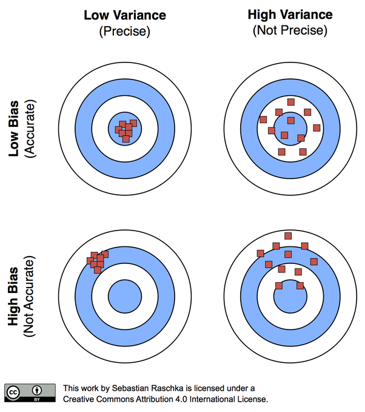

```{r setup, include=FALSE}
knitr::opts_chunk$set(echo = TRUE)
```

\newpage

# Recap

1. Simple linear regression

2. Multiple linear regression

3. Variable transformations

4. Detection and treatment of outliers: leverage and influence

5. Indicator variables

\newpage

# Qualitative variable with more than 2 levels

In general, a qualitative variable with $k$ levels is represented by $k-1$ indicator variables, each taking the values 0 and 1.

```{r, comment=NA, message=FALSE, echo=FALSE}
data <- data.frame(IQ=c(10, 20, 100, 98, 100, 11, 50, 70), BMI = c("Normal", "Normal", "Obese", "Obese", "Underweight", "Underweight", 
  "Underweight", "Underweight"), headcir = c(50.2, 50.5, 58.5, 55, 54.9, 40, 48.5, 50),
D1 =c(0, 0, 0, 0, 1, 1, 1, 1),
D2 = c(1, 1, 0, 0, 0, 0, 0, 0))
data

```

$D_1$ | $D_2$ | Description |
---|---|---| ---|
1|0|observation is from underweight |
0|1|observation is from normal |
0|0|observation is from Obese |


## Your turn

Write the regression equations for the three levels.

```{r, comment=NA, message=FALSE, echo=FALSE}
data <- data.frame(IQ=c(10, 20, 100, 98, 100, 11, 50, 70), headcir = c(50.2, 50.5, 58.5, 55, 54.9, 40, 48.5, 50),
D1 =c(0, 0, 0, 0, 1, 1, 1, 1),
D2 = c(1, 1, 0, 0, 0, 0, 0, 0))
data

```


\begin{equation}
  D_{1i} =
  \begin{cases}
    1 & \text{if underweight} \\
    0 & \text{otherwise}
  \end{cases}
\end{equation}

\begin{equation}
  D_{2i} =
  \begin{cases}
    1 & \text{if normal} \\
    0 & \text{otherwise}
  \end{cases}
\end{equation}

Let $x_i$ be the head circumference

$$y_i = \beta_0 + \beta_1x_i + \beta_2D_{1i} + \beta_3D_{2i} + \epsilon_i $$

For underweight

$$y_i = \beta_0 + \beta_1x_i + \beta_2 +  \epsilon_i $$

For normal

$$y_i = \beta_0 + \beta_1x_i +  \beta_3 + \epsilon_i $$

For overweight

$$y_i = \beta_0 + \beta_1x_i  + \epsilon_i $$


\newpage

## Different in both intercept and slope


```{r, comment=NA, message=FALSE, echo=FALSE}
data <- data.frame(IQ=c(10, 20, 100, 98, 100, 11, 50, 70), Gender = c("Male", "Male", "Male", "Male", "Female", "Female", 
  "Female", "Female"), BMI = c(20.2, 20.5, 18.5, 25, 24.9, 31, 18.5, 20))
data

```


Indicator variable for `Gender`

\begin{equation}
  D_{i} =
  \begin{cases}
    1 & \text{if male} \\
    0 & \text{if female}
  \end{cases}
\end{equation}


The choice of 0 and 1 to identify the levels of a qualitative variable is arbitrary.


$$y_i = \beta_0 + \beta_1 x_i + \beta_2D_i + \epsilon_i,$$

### Regression line differ in intercept only

Regression equation for **males**, $D_i = 1$

$$y_i = \beta_0 + \beta_1 x_i + \beta_2 + \epsilon_i,$$

Regression equation for **females**, $D_i = 0$

$$y_i = \beta_0 + \beta_1 x_i + \epsilon_i,$$

### Regression line both differ in slope and intercept


$$y_i = \beta_0 + \beta_1 x_i + \beta_2D_i + \beta_3x_iD_i + \epsilon_i,$$

Regression equation for **males**, $D_i = 1$

$$y_i = \beta_0 + \beta_1 x_i + \beta_2 + \beta_3x_i+ \epsilon_i,$$

$$y_i = (\beta_0 + \beta_2) + (\beta_1 + \beta_3)x_i+ \epsilon_i,$$


Regression equation for **females**, $D_i = 0$

$$y_i = \beta_0 + \beta_1 x_i +  \epsilon_i,$$

\newpage

# Variable Selection: Introduction


Variable selection: Finding an appropriate subset of regression for the model.

```{r, comment=NA, warning=FALSE, message=FALSE}
library(tidyverse)
realestate <- read.csv("real-estate.csv")
head(realestate)
```

<!--https://www.stat.cmu.edu/~cshalizi/mreg/15/lectures/26/lecture-26.pdf-->


```{r, comment=NA, message=FALSE, warning=FALSE}
glimpse(realestate)
```


```{r, comment=NA, message=FALSE, warning=FALSE}
summary(realestate)

```


```{r, comment=NA, message=FALSE, warning=FALSE}
realestate$Airconditioning <- factor(realestate$Airconditioning)
realestate$Pool <- factor(realestate$Pool)
realestate$AdjHighway <- factor(realestate$AdjHighway)
summary(realestate)
```


## Correlation matrix

```{r, comment=NA, message=FALSE, warning=FALSE, echo=FALSE, fig.width=7, fig.height=7}
realestate.var <- realestate[, -1]
library(GGally)
ggpairs(realestate.var)

```

\newpage

## All possible regression

In-class

\newpage

## Intercept-only regression model

```{r, comment=NA, message=FALSE}
realty.lm.minimal <- lm(Price ~ 1, data=realestate)
realty.lm.minimal
```


## Full model

```{r, comment=NA, message=FALSE, warning=FALSE}
realty.lm.all <- lm(Price ~ . , data=realestate.var)
realty.lm.all
```

We need model to include as few independent variables as possibles because the variance of the the predictions increases as the number of independent variables increases.




\newpage


## Computational Techniques for Variable Selection

1. All possible regression

2. Stepwise regression methods

    2.1 Forward selection
    
    2.2 Backward elimination
    
    2.3 Stepwise regression
    
## Criteria for evaluating subset regression models

- lowest p-value

- highest adjusted $R^2_{adj}$

- lowest Mallow’s $C_p$

- lowest AIC

- lowest residual mean square

- lowest score under cross-validation, etc.
    


\newpage

## Forward selection

- Starts with intercept-only regression model.

- Then we gradually add one more variable at a time (or add main effects first, then interactions).


**Intercept-only regression model**

```{r, comment=NA, message=FALSE}
realty.lm.minimal <- lm(Price ~ 1, data=realestate)
realty.lm.minimal
```


**Forward selection**

```{r, comment=NA, message=FALSE}
step(realty.lm.minimal, scope=list(upper = realty.lm.all,
lower= realty.lm.minimal), direction="forward",
trace=0)
```


```{r, comment=NA, message=FALSE}
step(realty.lm.minimal, scope=list(upper = realty.lm.all,
lower= realty.lm.minimal), direction="forward",
trace=1)
```

\newpage

## Backward elimination

-  we start with the full model and gradually delete variables one at a time.

```{r, comment=NA, message=FALSE, warning=FALSE}
step(realty.lm.all, direction="backward", trace=0)
```

```{r, comment=NA, message=FALSE, warning=FALSE}
step(realty.lm.all, direction="backward", trace=1)
```

\newpage

## Stepwise regression

```{r, comment=NA, message=FALSE}
step(realty.lm.minimal, scope=list(upper = realty.lm.all,
lower= realty.lm.minimal), direction="both", trace=0)

```


```{r, comment=NA, message=FALSE}
step(realty.lm.minimal, scope=list(upper = realty.lm.all,
lower= realty.lm.minimal), direction="both", trace=1)

```

In this example stepwise regression reaches the same answer as only doing forward selection.

## Model adequacy checking

```{r, comment=NA, message=FALSE, warning=FALSE}
model1 <- lm(Price ~ Sqft + Quality + YearBuild + Lot + Garage + Bedroom, data=realestate)
model1
summary(model1)
library(ggfortify)
autoplot(model1)
```


```{r, comment=NA, message=FALSE, warning=FALSE}
realestate$log.price <- log(realestate$Price)
model2 <- lm(log.price ~ Sqft + Quality + YearBuild + Lot + Garage + Bedroom, data=realestate)
model2
summary(model2)
library(ggfortify)
autoplot(model2)
```

**Normality test**

```{r, comment=NA, message=FALSE, warning=FALSE}
library(broom)
residout <- augment(model2)
residout
shapiro.test(residout$.resid)

```

Use level of significance: 0.01


## Note

In variable selection it is usually assumed that the correct functional specification of the regressors is known ($1/x$, $ln(Y)$), and that no outliers or influential observations are present. However, it practice these assumptions are rarely met.
Hence, in practice we often use i) a particular variable selection strategy is employed, and then ii) the resulting model is checked for model adequacy, outliers, and influential cases and update the model accordingly.

## Acknowledgement

Introduction to Linear Regression Analysis, Douglas C. Montgomery, Elizabeth A. Peck, G. Geoffrey Vining

Data: http://www.stat.cmu.edu/~cshalizi/mreg/15/hw/08/real-estate.csv

