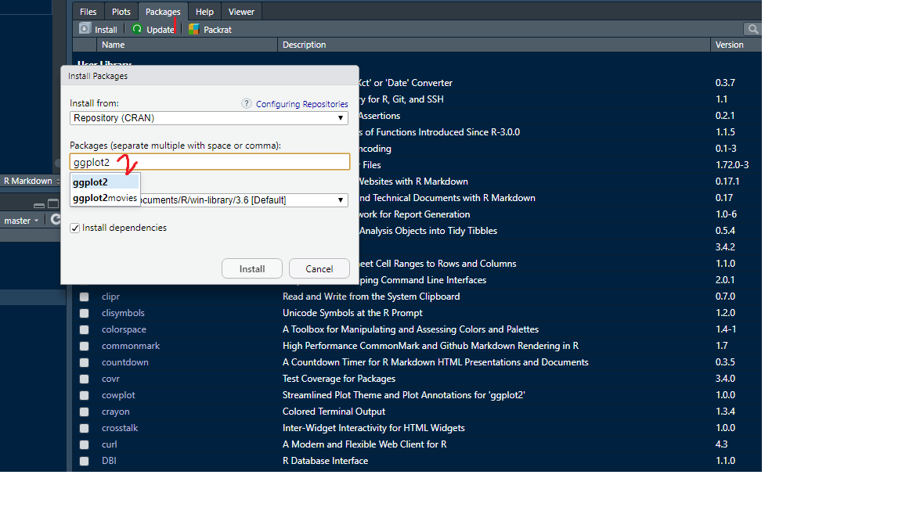

```{r setup, include=FALSE}
knitr::opts_chunk$set(echo = FALSE)
```

# Create an R project


**File -> New Project**

```{r, fig.height=4}

```


**Click on New Directory**

```{r, fig.height=4}

```


**Click on New Project**


```{r, fig.height=4}
knitr::include_graphics("newproject_name.png")
```


This will set up an RStudio project in a new directory called `slr_practical1` on the Desktop of your machine, and launch a new session of R in Rstudio. Your screen should look something like this.


```{r, fig.height=4}

```

# Installing Packages

## Method 1

```{r, fig.height=4}

```


```{r, fig.height=5}
knitr::include_graphics("loadpkg.jpeg")
```

## Method 2

```r
install.packages("ggplot2")
```

# Create an R Markdown document

**File -> New File -> R Markdown**

```{r, fig.height=4}

```


# Create a small dataset

```{r, comment=NA, echo=TRUE}
x <- c(1, 2, 3, 4, 5, 6, 7, 8, 9, 10)
y <- c(10, 20, 30, 40, 50, 60, 70, 80, 90, 100)
df <- data.frame(x=x, y=y)
df

```


