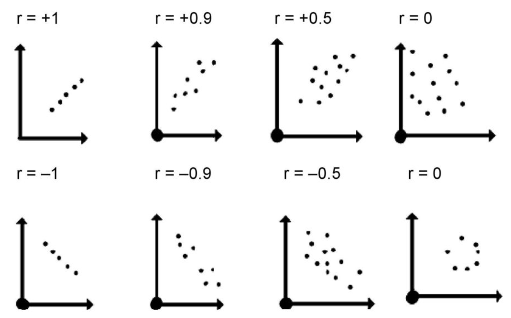
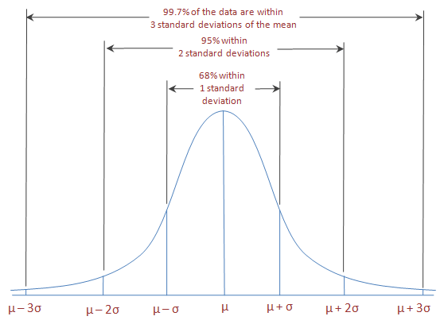
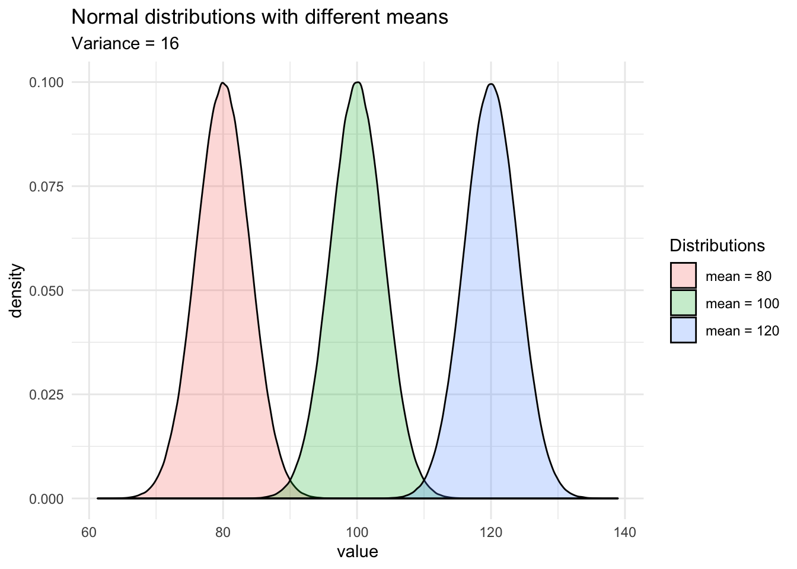
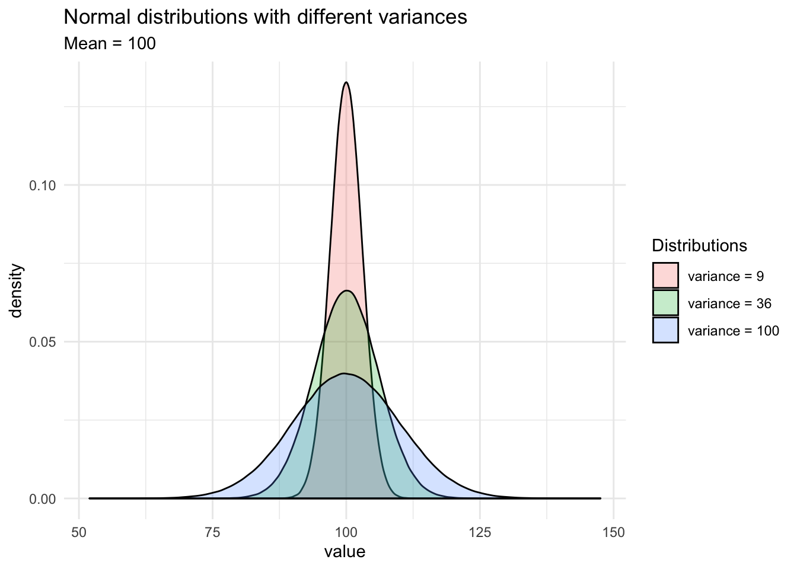

```{r setup, include=FALSE}
options(htmltools.dir.version = FALSE)
```

## Recap: correlation




---
## Recap: correlation (cont.)

.pull-left[


]

.pull-right[

```{r, comment=NA, echo=FALSE}
library(knitr)

cor <- data.frame(value=c("-1", "(-1, -0.75)",
                          "(-0.75, -0.5)",
                          "(-0.5, -0.25)",
                          "(-0.25, 0.25)",
                          "(0.25, 0.5)",
                          "(0.5, 0.75)",
                          "(0.75, 1)",
                          "1"),
                  interpretation = c("Perfect negative",
                                     "Strong negative",
                                     "Moderate negative",
                                     "Weak negative",
                                     "No linear association",
                                     "Weak positive",
                                     "Moderate positive",
                                     "Strong positive",
                                     "Perfect positive"))
kable(cor)
```
]
---
## Recap: Terminologies


- Response variable: dependent variable

- Explanatory variables: independent variables, predictors, regressor variables, features (in Machine Learning)

> Response variable = Model function + Random Error

- Parameter 

- Statistic

- Estimator

- Estimate

[Read my blogpost](https://thiyanga.netlify.app/post/statterms1/)


---
# In-class

---
# In-class

---
# Simple Linear Regression

**Simple** - single regressor

**Linear** - has a dual role here.

~~It may be taken to describe the fact that the relationship between $Y$ and $X$ is linear.~~ The word linear refers to the fact that the regression parameters enter in a linear fashion.

---

# Meaning of Linear Model

| What about this?

$$Y =  \beta_0 + \beta_1x_1 + \beta_{2}x_2 + \epsilon$$

--

| Linear or nonlinear?

 $$Y = \beta_0 + \beta_1x + \beta_{2}x^2 + \epsilon$$
<!--While the independent variable is squared, the model is still linear in the parameters. Linear models can also contain log terms and inverse terms to follow different kinds of curves and yet continue to be linear in the parameters.-->

--
| Linear or nonlinear?

$$Y = \beta_0e^{\beta_1x} + \epsilon$$
---

## Intrinsically Linear

$$Y = \alpha X_1^\beta X_2^\gamma X_3^\delta e^\epsilon$$

Let us take natural logarithms 

$$ln Y = ln (\alpha) + \beta ln(X_1) + \gamma ln(X_2) + \delta ln(X_3) + \epsilon$$
--
 What about this?

$$Y = \alpha X_1^\beta X_2^\gamma X_3^\delta + \epsilon$$


---

**True relationship between X and Y in the population**

$$Y = f(X) + \epsilon$$

**If $f$ is approximated by a linear function**

$$Y = \beta_0 + \beta_1X + \epsilon$$

The error terms are normally distributed with mean $0$ and variance $\sigma^2$. Then the mean response, $Y$, at any value of the $X$ is 

$$E(Y|X=x_i) = E(\beta_0 + \beta_1x_i + \epsilon)=\beta_0+\beta_1x_i$$

For a single unit $(y_i, x_i)$

$$y_i = \beta_0 + \beta_1x_i+\epsilon_i \text{  where  } \epsilon_i \sim N(0, \sigma^2)$$

We use sample values $(y_i, x_i)$ where $i=1, 2, ...n$ to estimate $\beta_0$ and $\beta_1$.

The fitted regression model is 

$$\hat{Y_i} = \hat{\beta}_0 + \hat{\beta}_1x_i$$
---
## Normal distribution

```{r, comment=NA, echo=FALSE, warning=FALSE, message=FALSE}
library(tidyverse)
set.seed(100)
dfr1 <- data.frame(data1=rnorm(1000, 5, 0.5), data2=rnorm(1000, 5, 20))

```

.pull-left[
```{r, comment=NA, warning=FALSE, message=FALSE, echo=FALSE}
ggplot(dfr1, aes(x=data1)) + 
geom_histogram(aes(y =..density..),
                   breaks = seq(2.5, 7.5, by = 0.1), 
                   colour = "white", 
                   fill = "#e7298a") 
mean(dfr1$data1)
```
]

.pull-left[
```{r, comment=NA, warning=FALSE, message=FALSE, echo=FALSE}
ggplot(dfr1, aes(x=data2)) + 
geom_histogram(aes(y =..density..),
                   breaks = seq(-70, 70, by = 2), 
                   colour = "white", 
                   fill = "#1b9e77") 
mean(dfr1$data2)
```
]

---
## Normal distribution

.pull-left[
```{r, comment=NA, warning=FALSE, message=FALSE, echo=FALSE}
ggplot(dfr1, aes(x=data1)) + 
geom_histogram(aes(y =..density..),
                   breaks = seq(2.5, 7.5, by = 0.1), 
                   colour = "white", 
                   fill = "#e7298a") +
stat_function(fun = dnorm, args = list(mean = mean(dfr1$data1), sd = sd(dfr1$data1)))
```
]

.pull-left[
```{r, comment=NA, warning=FALSE, message=FALSE, echo=FALSE}
ggplot(dfr1, aes(x=data2)) + 
geom_histogram(aes(y =..density..),
                   breaks = seq(-70, 70, by = 2), 
                   colour = "white", 
                   fill = "#1b9e77")  +
stat_function(fun = dnorm, args = list(mean = mean(dfr1$data2), sd = sd(dfr1$data2)))

```
]

---

### Normal distribution



From: https://towardsdatascience.com/do-my-data-follow-a-normal-distribution-fb411ae7d832

---
### Normal distribution



From: https://towardsdatascience.com/do-my-data-follow-a-normal-distribution-fb411ae7d832
---

### Normal distribution



From: https://towardsdatascience.com/do-my-data-follow-a-normal-distribution-fb411ae7d832
---
class:  duke-orange, center, middle

## Buckle up!

### Let's walk through the steps.
---
## In-class

**True relationship between X and Y in the population**

$$Y = f(X) + \epsilon$$
> 

---

## In-class

**True relationship between X and Y in the population**

$$Y = f(X) + \epsilon$$

Example: Suppose you want to model daughters' height as a function of mothers' height.

Do you think an exact (deterministic) relationship exists between these two variables?

---

## In-class

**True relationship between X and Y in the population**

$$Y = f(X) + \epsilon$$

Example: Suppose you want to model daughters' height as a function of mothers' height.

Do you think an exact (deterministic) relationship exists between these two variables?

> Why?

---
## In-class

**True relationship between X and Y in the population**

$$Y = f(X) + \epsilon$$

Example: Suppose you want to model daughters' height as a function of mothers' height.

Do you think an exact (deterministic) relationship exists between these two variables?

1. Daughters' height may depend on many other variables than Mothers' height.

---
## In-class

**True relationship between X and Y in the population**

$$Y = f(X) + \epsilon$$

Example: Suppose you want to model daughters' height as a function of mothers' height.

Do you think an exact (deterministic) relationship exists between these two variables?

1. Daughters' height may depend on many other variables than Mothers' height.

2. Even if many variables are included in the model, it is unlikely that we can predict the daughter's height exactly. Why?


---
## In-class

**True relationship between X and Y in the population**

$$Y = f(X) + \epsilon$$

Example: Suppose you want to model daughters' height as a function of mothers' height.

Do you think an exact (deterministic) relationship exists between these two variables?

1. Daughters' height may depend on many other variables than Mothers' height.

2. Even if many variables are included in the model, it is unlikely that we can predict the daughter's height exactly. Why?

There will almost certainly be some variations in the model predictions that cannot be modelled, or explained. 

These unexplained variances are assumed to be
caused by the unexplainable random phenomena, so they can be referred to as random
error.

---
## In-class
---

## In-class: Population Regression Line


**True relationship between X and Y in the population**

$$Y = f(X) + \epsilon$$

**If $f$ is approximated by a linear function**

$$Y = \beta_0 + \beta_1X + \epsilon$$

The error terms are normally distributed with mean $0$ and variance $\sigma^2$. Then the mean response, $Y$, at any value of the $X$ is 

$$E(Y|X=x_i) = E(\beta_0 + \beta_1x_i + \epsilon)=\beta_0+\beta_1x_i$$

---
## In-class: Population Regression Line

$$E(Y|X=x_i) = E(\beta_0 + \beta_1x_i + \epsilon)=\beta_0+\beta_1x_i$$

For a single unit $(y_i, x_i)$

$$y_i = \beta_0 + \beta_1x_i+\epsilon_i \text{  where  } \epsilon_i \sim N(0, \sigma^2)$$


---
## Take a sample: 

The fitted regression line is 

$$\hat{Y_i} = \hat{\beta}_0 + \hat{\beta}_1x_i$$

---
## Our example

Dashboard: https://statisticsmart.shinyapps.io/SimpleLinearRegression/

```{r, comment=NA, warning=FALSE, message=FALSE, fig.height=5.5, echo=FALSE}
library(ggplot2)
library(alr3)
ggplot(heights, aes(x=Mheight, y=Dheight))+geom_point(alpha=0.5)  +   xlab("Mother's height") + 
            ylab("Daughter's height") +
            ggtitle("Scatter plot of daughters' height vs mothers' height") + 
            theme(aspect.ratio = 1)
    

```

---
## Our example (0.52, 30.7)

Dashboard: https://statisticsmart.shinyapps.io/SimpleLinearRegression/

```{r, comment=NA, warning=FALSE, message=FALSE, fig.height=5.5, echo=FALSE}
library(ggplot2)
library(alr3)
ggplot(heights, aes(x=Mheight, y=Dheight))+geom_point(alpha=0.5)  +   xlab("Mother's height") + 
            ylab("Daughter's height") +
            ggtitle("Scatter plot of daughters' height vs mothers' height") + 
  geom_abline(intercept = 30.7, slope = 0.52, colour="forestgreen", lwd=2) +
            theme(aspect.ratio = 1)
    

```

---
## Our example (0.582, 28.5)

Dashboard: https://statisticsmart.shinyapps.io/SimpleLinearRegression/

```{r, comment=NA, warning=FALSE, message=FALSE, fig.height=5.5, echo=FALSE}
library(ggplot2)
library(alr3)
ggplot(heights, aes(x=Mheight, y=Dheight))+geom_point(alpha=0.5)  +   xlab("Mother's height") + 
            ylab("Daughter's height") +
            ggtitle("Scatter plot of daughters' height vs mothers' height") + 
  geom_abline(intercept = 30.7, slope = 0.52, colour="forestgreen", lwd=2) +
    geom_abline(intercept = 28.5, slope = 0.582, colour="#d95f02", lwd=2) +
            theme(aspect.ratio = 1)
    

```
---

## Our example (0.5, 32.5)

Dashboard: https://statisticsmart.shinyapps.io/SimpleLinearRegression/

```{r, comment=NA, warning=FALSE, message=FALSE, fig.height=5.5, echo=FALSE}
library(ggplot2)
library(alr3)
ggplot(heights, aes(x=Mheight, y=Dheight))+geom_point(alpha=0.5)  +   xlab("Mother's height") + 
            ylab("Daughter's height") +
            ggtitle("Scatter plot of daughters' height vs mothers' height") + 
  geom_abline(intercept = 30.7, slope = 0.52, colour="forestgreen", lwd=2) +
    geom_abline(intercept = 28.5, slope = 0.582, colour="#d95f02", lwd=2) +
   geom_abline(intercept = 32.5, slope = 0.5, colour="#7570b3", lwd=2) +
            theme(aspect.ratio = 1)
    

```

## Which is the best?
---
## Which is the best?

.pull-left[
```{r, comment=NA, warning=FALSE, message=FALSE, fig.height=7, echo=FALSE}
library(tidyverse)
library(broom)
library(alr3)
model1 <- lm(Dheight ~ Mheight, data=heights)
model1_fitresid <- augment(model1)
ggplot(model1_fitresid, aes(x = Mheight, y = Dheight)) +
geom_smooth(method = "lm", se = FALSE, color = "blue", lwd=2) +
geom_segment(aes(xend = Mheight, yend = .fitted), col="red", lwd=1) +
geom_point() +
geom_point(aes(y = .fitted), shape = 1)+
            theme(aspect.ratio = 1)
    

```
]

.pull-right[

Sum of squares of **Residuals**

$$SSR=e_1^2+e_2^2+...+e_n^2$$
]
---

## Evaluating your answers: Fitted values

.pull-left[
```{r, comment=NA, warning=FALSE, message=FALSE, fig.height=5.5, echo=FALSE}
library(ggplot2)
library(alr3)
library(ggplot2)
library(alr3)
ggplot(heights, aes(x=Mheight, y=Dheight))+geom_point(alpha=0.5)  +   xlab("Mother's height") + 
            ylab("Daughter's height") +
            ggtitle("Scatter plot of daughters' height vs mothers' height") + 
  geom_abline(intercept = 30.7, slope = 0.52, colour="forestgreen", lwd=2) +
            theme(aspect.ratio = 1)
    

```


]

.pull-right[
Dheight = 30.7 + 0.52Mheight

```{r, comment=NA, message=FALSE, warning=FALSE}
df <- alr3::heights
df$fitted <- 30.7 + (0.52*df$M)
head(df,10)

```

First fitted value: 30.7 + (0.52 * 59.7) = 61.744
]

---
## Evaluating your answers

.pull-left[
```{r, comment=NA, warning=FALSE, message=FALSE, fig.height=5.5, echo=FALSE}
library(ggplot2)
library(alr3)
library(ggplot2)
library(alr3)
ggplot(heights, aes(x=Mheight, y=Dheight))+geom_point(alpha=0.5)  +   xlab("Mother's height") + 
            ylab("Daughter's height") +
            ggtitle("Scatter plot of daughters' height vs mothers' height") + 
  geom_abline(intercept = 30.7, slope = 0.52, colour="forestgreen", lwd=2) +
            theme(aspect.ratio = 1)
    

```

Sum of squares of **Residuals**

$$SSR=e_1^2+e_2^2+...+e_n^2$$
]

.pull-right[
Dheight = 30.7 + 0.52Mheight

```{r, comment=NA, message=FALSE, warning=FALSE, echo=FALSE}
df$resid_squared <- (df$Dheight - df$fitted)^2
head(df, 10)
sum((df$Dheight - df$fitted)^2)

```

SSR: 7511.118
]

---
## Evaluating your answers

Dashboard: https://statisticsmart.shinyapps.io/SimpleLinearRegression/

.pull-left[
```{r, comment=NA, warning=FALSE, message=FALSE, fig.height=5.5, echo=FALSE}
library(ggplot2)
library(alr3)
ggplot(heights, aes(x=Mheight, y=Dheight))+geom_point(alpha=0.5)  +   xlab("Mother's height") + 
            ylab("Daughter's height") +
            ggtitle("Scatter plot of daughters' height vs mothers' height") + 
  geom_abline(intercept = 30.7, slope = 0.52, colour="forestgreen", lwd=2) +
    geom_abline(intercept = 28.5, slope = 0.582, colour="#d95f02", lwd=2) +
   geom_abline(intercept = 32.5, slope = 0.5, colour="#7570b3", lwd=2) +
            theme(aspect.ratio = 1)
    

```
]

.pull-right[

```{r, message=FALSE, warning=FALSE, echo=FALSE}
df$orange <- 0.582 * df$Mheight + 28.5
orange <- sum((df$Dheight - df$orange)^2)
df$purple <- 0.5 * df$Mheight + 32.5
purple <-  sum((df$Dheight - df$purple)^2)
```

- Green: 7511.118 (0.52, 30.7)

- Orange: 8717.41 (0.582, 28.5)

- Purple: 7066.075 (0.5, 32.5)
]
---

### How to estimate $\beta_0$ and $\beta_1$?

Sum of squares of Residuals

$$SSR=e_1^2+e_2^2+...+e_n^2$$

**Observed value**

$y_i$ 

**Fitted value**

$\hat{Y_i}$ 

$\hat{Y_i} = \hat{\beta}_0 + \hat{\beta}_1x_i$

**Residual**

$e_i = y_i - \hat{Y_i}$ 

The least-squares regression approach chooses coefficients $\hat{\beta}_0$ and $\hat{\beta}_1$ to minimize $SSR$.

---
### Least-squares Estimation of the Parameters

$$y_i = \beta_0 + \beta_1x_i + \epsilon_i \text{,  i =1, 2, 3, ...n .}$$

The least squares criterion is

$$S(\beta_0, \beta_1) = \sum_{i=1}^n (y_i - \beta_0 - \beta_1x_i)^2.$$
---
### Least-squares Estimation of the Parameters (cont.)

The least squares criterion is

$$S(\beta_0, \beta_1) = \sum_{i=1}^n (y_i - \beta_0 - \beta_1x_i)^2.$$

The least-squares estimators of $\beta_0$ and $\beta_1$, say $\hat{\beta_0}$ and $\hat{\beta_1},$ must satisfy

$$\frac{\partial S}{\partial \beta_0}|_{\hat{\beta_0}, \hat{\beta_1}} = -2\sum_{i=1}^{n}(y_i - \hat{\beta_0} - \hat{\beta_1}x_i) = 0$$

and

$$\frac{\partial S}{\partial \beta_1}|_{\hat{\beta_0}, \hat{\beta_1}} = -2\sum_{i=1}^{n}(y_i - \hat{\beta_0} - \hat{\beta_1}x_i)x_i = 0.$$
---

### Least-squares Estimation of the Parameters (cont.)

Simplifying the two equations yields

$$n\hat{\beta_0}+\hat{\beta_1}\sum_{i=1}^nx_i=\sum_{i=1}^ny_i,$$
$$\hat{\beta_0}\sum_{i=1}^nx_i+\hat{\beta_1}\sum_{i=1}^nx^2_i=\sum_{i=1}^ny_ix_i.$$

These are called **least-squares normal equations**.

---
## Least-squares Estimation of the Parameters (cont.)


$$n\hat{\beta_0}+\hat{\beta_1}\sum_{i=1}^nx_i=\sum_{i=1}^ny_i,$$

$$\hat{\beta_0}\sum_{i=1}^nx_i+\hat{\beta_1}\sum_{i=1}^nx^2_i=\sum_{i=1}^ny_ix_i.$$

The solution to the normal equation is

$$\hat{\beta_0} = \bar{y} - \hat{\beta_1}\bar{x},$$

and

$$\hat{\beta_1} = \frac{\sum_{i=1}^ny_ix_i - \frac{\sum_{i=1}^ny_i\sum_{i=1}^nx_i}{n}}{\sum_{i=1}^nx_i^2 - \frac{(\sum_{i=1}^nx_i)^2}{n}}.$$

The fitted simple linear regression model is then

$$\hat{Y} = \hat{\beta_0} + \hat{\beta}_1x$$

---
## Least-squares fit

> Try this with R

```{r, comment=NA}
library(alr3) # to load the dataset
model1 <- lm(Dheight ~ Mheight, data=heights)
model1
```
---
## Least-squares fit and your guesses


```{r, comment=NA, warning=FALSE, message=FALSE, fig.height=5.5, echo=FALSE}
library(ggplot2)
library(alr3)
ggplot(heights, aes(x=Mheight, y=Dheight))+geom_point(alpha=0.5)  +   xlab("Mother's height") + 
            ylab("Daughter's height") +
            ggtitle("Scatter plot of daughters' height vs mothers' height") + 
  geom_abline(intercept = 30.7, slope = 0.52, colour="forestgreen", lwd=2, alpha=0.7) +
    geom_abline(intercept = 28.5, slope = 0.582, colour="#d95f02", lwd=2, alpha=0.7) +
   geom_abline(intercept = 32.5, slope = 0.5, colour="#7570b3", lwd=2, alpha=0.7) +
  geom_abline(intercept = 29.9174, slope = 0.541, colour="blue", lwd=2) +
            theme(aspect.ratio = 1)
    

```

```{r, comment=NA, message=FALSE}
fit  <- 0.5417 * df$Mheight + 29.9174
sum((df$Dheight - fit)^2)
```

---
# Least square fit and your guesses

.pull-left[
```{r, comment=NA, warning=FALSE, message=FALSE, fig.height=5.5, echo=FALSE}
library(ggplot2)
library(alr3)
ggplot(heights, aes(x=Mheight, y=Dheight))+geom_point(alpha=0.5)  +   xlab("Mother's height") + 
            ylab("Daughter's height") +
            ggtitle("Scatter plot of daughters' height vs mothers' height") + 
  geom_abline(intercept = 30.7, slope = 0.52, colour="forestgreen", lwd=2, alpha=0.7) +
    geom_abline(intercept = 28.5, slope = 0.582, colour="#d95f02", lwd=2, alpha=0.7) +
   geom_abline(intercept = 32.5, slope = 0.5, colour="#7570b3", lwd=2, alpha=0.7) +
  geom_abline(intercept = 29.9174, slope = 0.541, colour="blue", lwd=2) +
            theme(aspect.ratio = 1)
    

```
]

.pull-right[
```{r, comment=NA, message=FALSE,eval=FALSE, echo=FALSE}
fit  <- 0.5417 * df$Mheight + 29.9174
sum((df$Dheight - fit)^2)
```
- Green: 7511.118 (0.52, 30.7)

- Orange: 8717.41 (0.582, 28.5)

- Purple: 7066.075 (0.5, 32.5)

- Blue: **7051.97** (0.541, 29.9174)

]

---
## Try this with R

```{r, comment=NA, eval=FALSE}
library(alr3) # to load the dataset
model1 <- lm(Dheight ~ Mheight, data=heights)
model1
```

```{r, comment=NA}
summary(model1)

```

---
## Visualise the model: Try with R

```{r, comment=NA, fig.height=5, message=FALSE, warning=FALSE}
ggplot(data=heights, aes(x=Mheight, y=Dheight)) + 
  geom_point(alpha=0.5) +
  geom_smooth(method="lm", se=FALSE,
               col="blue", lwd=2) +
  theme(aspect.ratio = 1)
    
```


---
## Least squares regression line
.pull-left[

```{r, comment=NA, fig.height=7, message=FALSE, warning=FALSE, echo=FALSE}
library(tidyverse)
ggplot(data=heights, aes(x=Mheight, y=Dheight)) + 
  geom_point(alpha=0.5) +
  geom_smooth(method="lm", se=FALSE,
               col="blue", lwd=2) +
  theme(aspect.ratio = 1) + geom_vline(xintercept =  62.4528) + 
  geom_hline(yintercept =  63.75105) 
    
```
]

.pull-right[

```{r, comment=NA}
summary(alr3::heights)
```


]

The LSRL passes through the point ( $\bar{x}$, $\bar{y}$), that is (sample mean of $x$, sample mean of $y$)
---
## Least squares regression line

.pull-left[
```{r, comment=NA, fig.height=7, message=FALSE, warning=FALSE, echo=FALSE}
library(tidyverse)
ggplot(data=heights, aes(x=Mheight, y=Dheight)) + 
  geom_point(alpha=0.5) +
  geom_smooth(method="lm", se=FALSE,
               col="blue", lwd=2) +
  theme(aspect.ratio = 1)
    
```

]

.pull-right[

The least squares regression line doesn't match the population regression line perfectly, but it is a pretty good estimate. And, of course, we'd get a different least squares regression line if we took another (different) sample.
]
---


background-image: url('reg7.PNG')
background-position: center
background-size: contain


---
## Extrapolation: beyond the scope of the model.

```{r, comment=NA, fig.height=7, message=FALSE, warning=FALSE, echo=FALSE}
library(tidyverse)
ggplot(data=heights, aes(x=Mheight, y=Dheight)) + 
  geom_point(alpha=0.5) + xlim(c(40, 80)) +
  geom_smooth(method="lm", se=FALSE,
               col="blue", lwd=2) +
  geom_vline(xintercept = 55.4) + 
  geom_vline(xintercept = 70.8)
    
```

---
## Next Lecture

> More work - Simple Linear Regression, Residual Analysis, Predictions
---
class: center, middle

All rights reserved by 

[Dr. Thiyanga S. Talagala](https://thiyanga.netlify.app/) 


