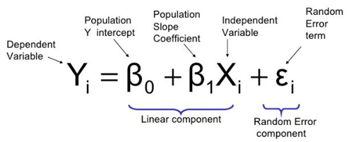
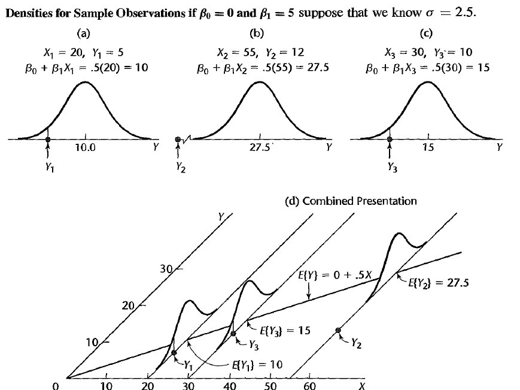
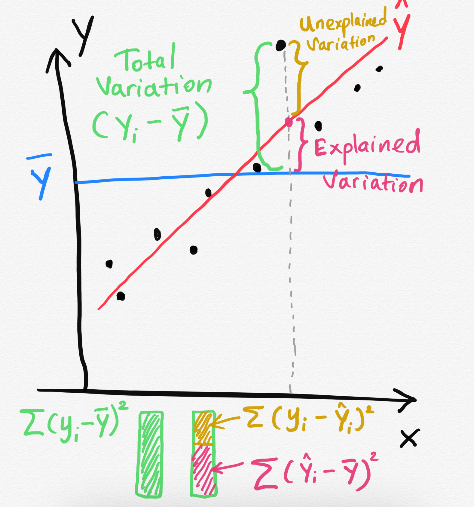

```{r setup, include=FALSE}
options(htmltools.dir.version = FALSE)
```


# Steps

1. Fit a model.

2. Visualize the fitted model.

3. Model Adequacy Checking

5. Interpret the coefficients. 

6. Make predictions using the fitted model.

---

# Fitted model

```{r, comment=NA, warning=FALSE}
library(alr3) # to load the dataset
model1 <- lm(Dheight ~ Mheight, data=heights)
model1
```

---
# Model summary

```{r, comment=NA, warning=FALSE}
summary(model1)
```


---
## Interesting questions come to mind

1. How well does this equation fit the data?

2. Is the model likely to be useful as a predictor?

3. Are any of the basic assumptions violated, and if so, how series is this?


> All of these questions must be investigated before using the model.

> Residuals play a key role in answering the questions.

---



---

---
## Model assumptions

1) The relationship between the response $Y$ and the regressors is linear, at least approximately.

---

## Model assumptions

 2) The error term $\epsilon$ has zero mean.

 3) The error term $\epsilon$ has constant variance $\sigma^2$.


source: http://reliawiki.org/index.php/Simple_Linear_Regression_Analysis
---
## Model assumptions

4) The error are uncorrelated.

5) The errors are normally distributed.

> Taking together 4 and 5 imply the errors are independent random variables. 

> Assumption 5 is required for parametric statistical inference (Hypothesis testing, Interval estimation).

---

## Diagnosing violations of the assumptions

Diagnosing methods are primarily based on model residuals.

## Residuals

$$e_i = \text{Observed value} - \text{Fitted value}$$

$$e_i = y_i - \hat{Y_i}$$

- Deviation between the observed value (true value) and fitted value.


---
```{r, comment=NA, message=FALSE, warning=FALSE}
df <- alr3::heights
df$fitted <- 30.7 + (0.52*df$M)
head(df,10)

```

First fitted value: 30.7 + (0.52 * 59.7) = 61.744

---
```{r, comment=NA, message=FALSE, warning=FALSE}
df <- alr3::heights
df$fitted <- 30.7 + (0.52*df$M)
df$residuals <- df$Dheight - df$fitted
head(df,10)

```

First fitted value: 30.7 + (0.52 * 59.7) = 61.744


First residual value: 55.1 - 61.744 = -6.644

- It is convenient to think of residuals as the realized or observed values of the model error.

- Residuals have zero mean.

- Residuals are **not** independent.

---
### Observation-level statistics: `augment()`

```{r, comment=NA, message=FALSE, warning=FALSE}
library(broom)
library(tidyverse)
model1_fitresid <- augment(model1)
model1_fitresid
```
---
class:  duke-orange, center, middle

# Residual analysis
---

background-image: url('errors.PNG')
background-position: right
background-size: contain

## Plot of residuals vs fitted values

.pull-left[
This is useful for detecting several common types of model inadequacies.
]


---
### Our example

 1) The relationship between the response $Y$ and the regressors is linear, at least approximately.  (Residuals vs Fitted/ Residual vs X - this is optional in Simple Linear Regression)

 2) The error term $\epsilon$ has zero mean. (Residuals vs Fitted)

 3) The error term $\epsilon$ has constant variance $\sigma^2$. (Residuals vs Fitted)


.pull-left[

Residuals vs Fitted


```{r, comment=NA, echo=FALSE, fig.height=4, , fig.width=4}
ggplot(model1_fitresid, 
  aes(x = .fitted, y = .resid))+
  geom_point() +
  geom_hline(yintercept = 0, col = "blue", size = 1)

```
]


.pull-right[

Residuals vs X


```{r comment=NA, echo=FALSE, fig.height=4, , fig.width=4}
ggplot(model1_fitresid, 
  aes(x = Mheight, y = .resid))+
  geom_point() +
  geom_hline(yintercept = 0, col = "blue", size = 1)

```
]


---
### Note

In simple linear regression, it is not necessary to plot residuals versus both fitted values and regressor variable. The reason is fitted values are linear combinations of the regressor variable, so the plot would only differ in the scale for the abscissa.


---

## 4) The error are uncorrelated.

- Often, we can conclude that the this assumption is sufficiently met
based on a description of the data and how it was collected.

> Use a random sample to ensure independence of observations.

- If the time sequence in which the data were collected is known, plot of residuals in time sequence.

---
## 5) The errors are normally distributed.


.pull-left[
```{r, comment=NA, message=FALSE, fig.height=4.5}
ggplot(model1_fitresid, 
       aes(x=.resid))+
  geom_histogram(colour="white")+ggtitle("Distribution of Residuals")
```
]

.pull-right[
```{r, comment=NA, message=FALSE, fig.height=4.5}
ggplot(model1_fitresid, 
       aes(sample=.resid))+
  stat_qq() + stat_qq_line()+labs(x="Theoretical Quantiles", y="Sample Quantiles")
```

]

```{r, comment=NA, message=FALSE, fig.height=4}
shapiro.test(model1_fitresid$.resid)
```

---
## 5) The errors are normally distributed (cont.)

$H0:$ Errors are normally distributed.

$H1:$ Errors are not normally distributed.

---
class:  duke-orange, center, middle


# Coefficient of Determination

---


.pull-right[


]

.pull-left[
> Residuals measure the variability in the **response variable** not explained by the regression model.

]
---

background-image: url('weight2.png')
background-position: center
background-size: contain


---
## Coefficient of Determination

$$R^2 = \frac{SS_M}{SS_T} = 1-\frac{SS_{R}}{SS_T}$$

$SS_T$ - A measure of the variability in $y$ without considering the effect of the regressor variable $x$.

Measures the variation of  $y$ values around their mean.

$SS_M$ - Explained variation attributable to factors other than the relationship between $x$ and $y$.

Notation: $SS_{R}$ or $SS_{E}$ - A measure of the variability in $y$ remaining after $x$ has been considered.

$R^2$ - Proportion of variation in $Y$ explained by the relation relationship of $Y$ with $x$.


---

## Coefficient of Determination

$$0 \leq R^2 \leq 1$$.

Values of $R^2$ that are close to 1 imply that most of the variability in $Y$ is explained by the regression model.

$R^2$ should be interpreted with caution. (We will talk more on this in multiple linear regression analysis)

---
### Our example

```{r, comment=NA, message=FALSE, warning=FALSE}
summary(model1)

```

$24\%$ of the variability in daughter's height is accounted by the regression model.
---
# $R^2$ = 24.08%

- Maybe you have one or more omitted variables. It is important to consider other factors that might influence the daughter's height:

    - Father's height

    - Physical activities performed by the daughter

    - Food nutrition, etc.

- Maybe the functional form of the regression form is incorrect (so you have to add some quadratic, or cubic terms...). At the same time a transformation can be an alternative (if appropriate).

- Maybe could be the effect of a group of outlier (maybe not one...).

---

- A large $R^2$ does not necessarily imply that the regression model will be an accurate predictor.

- $R^2$ does not measure the appropriateness of the linear model.

- $R^2$ will often large even though $Y$ and $X$ are nonlinearly related. 

---
## Relationship between $r$ and $R^2$

```{r, comment=NA}
cor(heights$Mheight, heights$Dheight)
cor(heights$Mheight, heights$Dheight)^2
```
---
## Is correlation enough?

- Correlation is only a measure of association and is of little use in prediction.

- Regression analysis is useful in developing a functional relationship between variables, which can be used for prediction and making inferences.


---
## Next Lecture

> More work - Simple Linear Regression, Hypothesis testing, Predictions
---
class: center, middle


Acknowledgement

Introduction to Linear Regression Analysis, Douglas C. Montgomery, Elizabeth A. Peck, G. Geoffrey Vining

All rights reserved by 

[Dr. Thiyanga S. Talagala](https://thiyanga.netlify.app/) 

