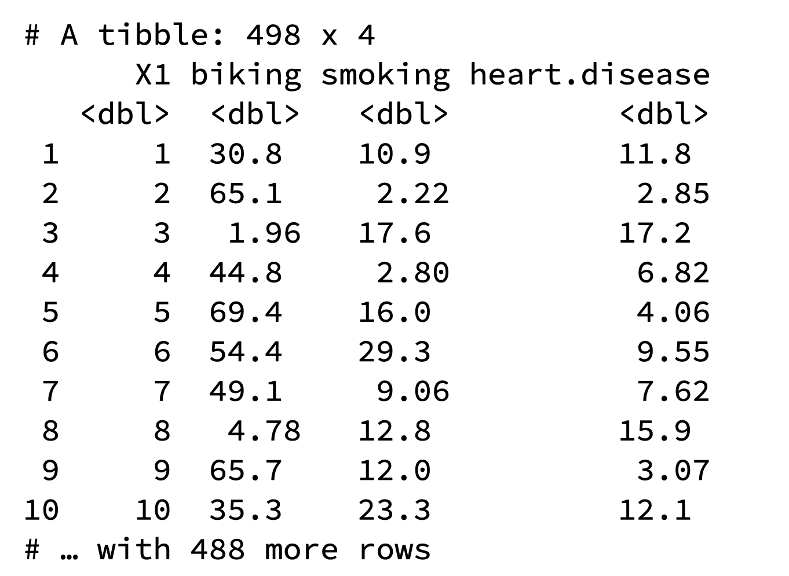

```{r setup, include=FALSE}
options(htmltools.dir.version = FALSE)
```

## Multiple Linear Regression

- A regression model that involves **two or more independent variables** and **one dependent variable**.


.content-box-blue[Simple Linear Regression

$$Y = \beta_0 + \beta_1X_1 + \epsilon$$

In terms of the observed values, 

$$y_i = \beta_0 + \beta_1x_i + \epsilon_i$$


]
.content-box-yellow[Multiple Linear Regression

$$Y = \beta_0 + \beta_1X_1 + \beta_2X_2+...+\beta_pX_p +  \epsilon$$

In terms of the observed values, 

$$y_i = \beta_0 + \beta_1x_{i1} + \beta_2x_{i2}+...+\beta_px_{ip} +  \epsilon_i$$

]

---

## Multiple Linear Regression


$$Y = \beta_0 + \beta_1X_1 + \beta_2X_2+...+\beta_pX_p +  \epsilon$$

In terms of the observed values, 

$$y_i = \beta_0 + \beta_1x_{i1} + \beta_2x_{i2}+...+\beta_px_{ip} +  \epsilon_i$$


### Notation for the data in multiple regression analysis

| Observation No.  |  Response |     Predictor 1    | Predictor 2 |...|Predictor p
|:-:|:-:|:-:|:-:|:-:|:-:|
|   | $Y$  | $X_1$  | $X_2$  | ...  |  $X_p$ |
| 1  | $y_1$  | $x_{11}$  | $x_{12}$  |  ... | $x_{1p}$  |
| 2  | $y_2$  | $x_{21}$  | $x_{22}$  |  ... | $x_{2p}$  |
| 3  | $y_3$  | $x_{31}$  | $x_{32}$  |  ... | $x_{3p}$  |
| .  |  . | .  | .  | . .. |  . |
| n  | $y_n$  | $x_{n1}$  | $x_{n2}$  |  ... | $x_{np}$  |

---

#### Multiple linear regression model with $p$ predictors

$$y_i = \beta_0 + \beta_1x_{i1} + \beta_2x_{i2}+...+\beta_px_{ip} +  \epsilon_i$$

> $y_i$ represents the $i^{th}$ value of the response variable $Y$.

> $x_{i1}, x_{i2}, ...x_{ip}$ represent values of the predictor variables for the $i^{th}$ observation.

> $\beta_0, \beta_1, ...\beta_p$ are called the **partial regression coefficients**.

#### Model assumptions

1. The relationship between the response $Y$ and the predictors is linear, at least approximately.

2. The error term $\epsilon$ has zero mean.

3. The error term $\epsilon$ has constant variance $\sigma^2$.

4. The errors are uncorrelated.

5. The errors are normally distributed.

Taken together, assumptions 4 and 5 imply that the errors are independent.

Assumption 5 is required for hypothesis testing and interval estimation.

---

## Example: 

Crop yields prediction based on temperature  and amount of fertilizer added.

A multiple regression model that  might describe this relationship is

$Y = \beta_0 + \beta_1X_1 + \beta_2 X_2 +  \epsilon$

where,

$Y$       denotes the yield

$X_1$      denotes the temperature

$X_2$      denotes the amount of fertilizer added

$\beta_0$  denotes population intercept

$\beta_1$  denotes partial regression coefficient of the variable temperature

$\beta_2$  denotes partial regression coefficient of the variable amount of fertilizer added

$\epsilon$ random error term.


---
### Visualization

.pull-left[

#### Simple linear regression

```{r, comment=NA, warning=FALSE, message=FALSE, fig.height=6, echo=FALSE}
library(ggplot2)
library(alr3)
library(ggplot2)
library(alr3)
ggplot(heights, aes(x=Mheight, y=Dheight))+geom_point(alpha=0.5)  +   xlab("Mother's height") + 
            ylab("Daughter's height") +
            ggtitle("Scatter plot of daughters' height vs mothers' height") + theme(aspect.ratio = 1)
    

```


]


.pull-right[

#### Multiple linear regression

```{r, comment=NA, message=FALSE, warning=FALSE, echo=FALSE}
library(scatterplot3d)
# Input data
x1 <- c(1.9,0.8,1.1,0.1,-0.1,4.4,4.6,1.6,5.5,3.4)
x2 <- c(66, 62, 64, 61, 63, 70, 68, 62, 68, 66)
y <- c(0.7,-1.0,-0.2,-1.2,-0.1,3.4,0.0,0.8,3.7,2.0)
dataset = cbind.data.frame(x1,x2,y)
scatterplot3d(x1,x2,y)
```


]


---
### Visualization

.pull-left[

#### Simple linear regression

```{r, comment=NA, warning=FALSE, message=FALSE, fig.height=6, echo=FALSE}
library(ggplot2)
library(alr3)
library(ggplot2)
library(alr3)
ggplot(heights, aes(x=Mheight, y=Dheight))+geom_point(alpha=0.5)  +   xlab("Mother's height") + 
            ylab("Daughter's height") +
            ggtitle("Scatter plot of daughters' height vs mothers' height") + 
  geom_abline(intercept = 30.7, slope = 0.52, colour="forestgreen", lwd=2) +
            theme(aspect.ratio = 1)
    

```


]


.pull-right[

#### Multiple linear regression

```{r, comment=NA, message=FALSE, warning=FALSE, echo=FALSE}
y_hat <- c(0.78901682, -0.39652923,  0.08373144, -0.88418673, -0.62895076,  2.60463202,  2.34939604,
 -0.03648971,  2.75444050,  1.46409091)

plot3d <- scatterplot3d(x1,x2,y,
angle=55, scale.y=0.7, pch=16, color ="red", main ="Regression Plane")
my.lm<- lm(y ~ x1 + x2,data=dataset)
plot3d$plane3d(my.lm, lty.box = "solid")
#plot3d$points3d(x1,x2,y_hat,col="blue", type="h", pch=16)
```


]

Simple linear regression: **line of best fit**

Multiple linear regression: **plane of best fit**

> More than 2 independent variables: Hard to visualize.

---
### Visualization

.pull-left[

#### Simple linear regression

```{r, comment=NA, warning=FALSE, message=FALSE, fig.height=6, echo=FALSE}
library(ggplot2)
library(alr3)
library(ggplot2)
library(alr3)
ggplot(heights, aes(x=Mheight, y=Dheight))+geom_point(alpha=0.5)  +   xlab("Mother's height") + 
            ylab("Daughter's height") +
            ggtitle("Scatter plot of daughters' height vs mothers' height") + 
  geom_abline(intercept = 30.7, slope = 0.52, colour="forestgreen", lwd=2) +
            theme(aspect.ratio = 1)
    

```


]


.pull-right[

#### Multiple linear regression + Fitted values (blue)

```{r, comment=NA, message=FALSE, warning=FALSE, echo=FALSE}
y_hat <- c(0.78901682, -0.39652923,  0.08373144, -0.88418673, -0.62895076,  2.60463202,  2.34939604,
 -0.03648971,  2.75444050,  1.46409091)

plot3d <- scatterplot3d(x1,x2,y,
angle=55, scale.y=0.7, pch=16, color ="red", main ="Regression Plane")
my.lm<- lm(y ~ x1 + x2,data=dataset)
plot3d$plane3d(my.lm, lty.box = "solid")
plot3d$points3d(x1,x2,y_hat,col="blue", type="h", pch=16)
```


]

Simple linear regression: **line of best fit**

Multiple linear regression: **plane of best fit**

More than 2 independent variables: Hard to visualize.
---
## Modelling steps

1. Exploratory Data Analysis

2. Fitting a models

3. Assess the model

    - How well it fits the data

    - Is it useful

    - Are any required conditions violated?

4. Employ the model

    - Interpreting the coefficients

    - Predictions using the prediction equation

    - Estimating the expected value of the dependent variable


---

# Example

A public health researcher interested in social factors that influence heart disease. He surveyed 500 towns and gather data on the **percentage of people in each town who smoke**, **the percentage of people in each town who bike to work**, and **the percentage of people in each town who have heart disease**.

Download the dataset from the course website: heart.data under week 8 [here](https://thiyanga.netlify.app/courses/regression2020/contentreg/).


---

## Read data into R


```{r, message=FALSE, comment=NA}
library(tidyverse)
heart.data <- read_csv("heart.data.csv")
heart.data 
```


---

## Variable description

```{r echo=FALSE, out.width='50%'}

```


.red[X1] - Town ID

.red[biking] - percentage of people in each town who bike to work

.red[smoking] -  percentage of people in each town who smoke

.red[heart.disease] - percentage of people in each town who have heart disease

---

### Scatterplot matrix/ correlogram 


```{r,comment=NA, message=FALSE, warning=FALSE, fig.height=6.6}
library(GGally) # Make sure you install the package before running the code
ggpairs(heart.data[,c("biking", "smoking", "heart.disease")])

```


---

### Scatterplot matrix/ correlogram 

.pull-left[
```{r, echo=FALSE, comment=NA, message=FALSE, warning=FALSE, fig.height=6.6}
library(GGally) # Make sure you install the package before running the code
ggpairs(heart.data[,c("biking", "smoking", "heart.disease")])

```
]

.pull-right[


Scatterplots of each pair of numeric variable are drawn on the left part of the figure. Pearson correlation is displayed on the right. Variable distribution is available on the diagonal.


]


---

### Scatterplot matrix/ correlogram 

.pull-left[
```{r, echo=FALSE, comment=NA, message=FALSE, warning=FALSE, fig.height=6.6}
library(GGally) # Make sure you install the package before running the code
ggpairs(heart.data[,c("biking", "smoking", "heart.disease")])

```
]

.pull-right[


```{r, comment=NA,  message=FALSE, warning=FALSE}
qplot(data=heart.data,
      x=biking) +
  geom_histogram(color="black",
      fill="#d95f02")
```


]

---

### Scatterplot matrix

.pull-left[
```{r, echo=FALSE, comment=NA, message=FALSE, warning=FALSE, fig.height=6.6}
library(GGally) # Make sure you install the package before running the code
ggpairs(heart.data[,c("biking", "smoking", "heart.disease")])

```
]

.pull-right[


```{r, comment=NA, message=FALSE, warning=FALSE}
qplot(data=heart.data,
      x=smoking) +
  geom_histogram(color="black", 
  fill="forestgreen")
```


]

---

### Scatterplot matrix

.pull-left[
```{r, echo=FALSE, comment=NA, message=FALSE, warning=FALSE, fig.height=6.6}
library(GGally) # Make sure you install the package before running the code
ggpairs(heart.data[,c("biking", "smoking", "heart.disease")])

```
]

.pull-right[


```{r, comment=NA, message=FALSE, warning=FALSE}
qplot(data=heart.data, 
      x=heart.disease) +
  geom_histogram(color="black", 
      fill="yellow")
```


]

---

## Fit a regression model

```{r, comment=NA, message=FALSE, warning=FALSE}

regHeart <-  lm(heart.disease ~ biking+ smoking, data=heart.data)

regHeart

```

--

.red[Fitted regression model]

$\hat{Y} = 14.9847 - 0.2001X_1 + 0.1783X_2$

where 

$\hat{Y}$ - Fitted values

$X_1$ - percentage of people in each town who bike to work

$X_2$ - percentage of people in each town who smoke
---

## Model description

```{r, comment=NA}
summary(regHeart)

```

---

### Regression Diagnostics (Model adequacy checking)

.blue[

1. The relationship between the response $Y$ and the predictors is linear, at least approximately. 

2. The error term $\epsilon$ has zero mean. 

3. The error term $\epsilon$ has constant variance $\sigma^2$. 

4. The errors are uncorrelated. 

5. The errors are normally distributed.

]


.red[

Is multicollinearity a problem?]

---

## Compute residuals and fitted values

```{r, comment=NA, message=FALSE, warning=FALSE}
library(broom)
regHeart_values <- augment(regHeart)
regHeart_values

```

---

## Residuals versus fitted values

```{r, comment=NA, message=FALSE, warning=FALSE, fig.height=6}
qplot(data=regHeart_values, y=.resid, x=.fitted)
```

---

### Regression Diagnostics (Model adequacy checking)

.blue[

1. The relationship between the response $Y$ and the predictors is linear, at least approximately. ✅

2. The error term $\epsilon$ has zero mean. ✅

3. The error term $\epsilon$ has constant variance $\sigma^2$. ✅

4. The errors are uncorrelated. ⬅️

5. The errors are normally distributed.

]


.red[

Is multicollinearity a problem?]

---


### Regression Diagnostics (Model adequacy checking)

.blue[

1. The relationship between the response $Y$ and the predictors is linear, at least approximately. ✅

2. The error term $\epsilon$ has zero mean. ✅

3. The error term $\epsilon$ has constant variance $\sigma^2$. ✅

4. The errors are uncorrelated. ✅

5. The errors are normally distributed.

]


.red[

Is multicollinearity a problem?]

---

.pull-left[

```{r, comment=NA, message=FALSE, fig.height=4}
qplot(data=regHeart_values,
      x=.resid,)+
  geom_histogram(color="black", 
                 fill="lightblue")
```

```{r, comment=NA, message=FALSE}
shapiro.test(regHeart_values$.resid)
```


]

.pull-right[

```{r, comment=NA, message=FALSE, fig.height=4}
ggplot(regHeart_values, 
       aes(sample=.resid))+
  stat_qq() + 
  stat_qq_line() +
  labs(x="Theoretical Quantiles",
       y="Sample Quantiles")
```

H0: Errors are normally distributed.

H1: Errors are not normally distributed.


]

Decision: We do not reject H0 under 0.05 level of significance.

Conclusion: We do not have enough evidence to conclude that errors are not normally distributed.


---


### Regression Diagnostics (Model adequacy checking)

.blue[

1. The relationship between the response $Y$ and the predictors is linear, at least approximately. ✅

2. The error term $\epsilon$ has zero mean. ✅

3. The error term $\epsilon$ has constant variance $\sigma^2$. ✅

4. The errors are uncorrelated. ✅

5. The errors are normally distributed. ✅

]


.red[

Is multicollinearity a problem?]


---

## Multicollinearity

Multicollinearity generally occurs when there are high correlations between two or more predictor variables.

```{r, echo=FALSE, comment=NA, message=FALSE, warning=FALSE, fig.height=6}
library(GGally) # Make sure you install the package before running the code
ggpairs(heart.data[,c("biking", "smoking", "heart.disease")])

```

How to Measure Multicollinearity? Next lecture.


---


### Regression Diagnostics (Model adequacy checking)

.blue[

1. The relationship between the response $Y$ and the predictors is linear, at least approximately. ✅

2. The error term $\epsilon$ has zero mean. ✅

3. The error term $\epsilon$ has constant variance $\sigma^2$. ✅

4. The errors are uncorrelated. ✅

5. The errors are normally distributed. ✅

]


.red[

Is multicollinearity a problem? No, based on scatterplot matrix]

Next week we will discuss how to measure multicollinearity.

---
## Coefficient of determination

```{r, comment=NA, out.width='4in'}
summary(regHeart)
```

.pull-left[
R-squared: $R^2  = 97.96\%$
]

.pull-right[

Adjusted R-squared: $R^2_{adj} = 97.95\%$
]
---

### $R^2$ and Adjusted $R^2_{adj}$

- Two ways to assess the overall adequacy of the model $R^2$ and Adjusted $R^2_{adj}$.

- $R^2$ always increases when an independent variable is added to the model, regardless of the value of the contribution of that variable.

- Hence, it is difficult to judge whether an increase in $R^2$ is really telling anything important.

- $R^2_{adj}$ will only increase on adding a variable to the model if the addition of the variable reduces the residual mean square.
---

#### $R^2$ and Adjusted $R^2_{adj}$

- Therefore, in multiple linear regression model we prefer to use an adjusted $R^2_{adj}$ statistic, defined as


$$R^2_{adj} = 1-\frac{SSE/(n-p)}{SST/(n-1)}$$

$$\sum_{i=1}^n(y_i - \bar{y})^2=\sum_{i=1}^n(\hat{Y}_i - \bar{y})^2 + \sum_{i=1}^n(y_i - \hat{Y_i})^2$$

$$SST = SSM + SSE$$


.pull-left[
n - total number of observations

p - number of independent variables

$$MSE = \frac{SSE}{n-p}$$

]

.pull-right[
SSE - Residual (error) sum of squares

SST - Total variation

MSE - Residual mean square 

]


A statistical measure that represents the proportion of the variance for a dependent variable that's explained by an independent variable or variables in a regression model

---

### Interpretation of $R^2_{adj}$

```{r, echo=FALSE, comment=NA, out.width='4in'}
summary(regHeart)
```


Then, it means that the independent variables - biking and smoking explain 97.9% of the variation in the response variable - `heart.disease`.


---

## Interpretation of coefficients

$$Y = \beta_0 + \beta_1X_1 + \beta_2X_2+...+\beta_pX_p +  \epsilon$$

.content-box-yellow[ Intercept]

$\beta_0$ - population mean of $Y$ when all the independent variable take the value zero. 

If the data range of all the independent variables do not cover the value zero, do not interpret the intercept.

--

.content-box-yellow[Partial regression coefficients]

The parameters, $\beta_j, \text{ } j=1, ..p.$

The parameter $\beta_j$ represents the mean change in the response $Y$ per unit change in $X_j$ **when all of the remaining independent variables are held constant.**

That's why $\beta_j, j=1, 2, ..p$ are often called partial regression coefficients.

---
## Interpretation of coefficients (cont.)

```{r, comment=NA, echo=FALSE}
regHeart
```

$\hat{\beta_0} = 14.9847$

An estimate of population mean percentage of people who have heart disease when there are zero percentage of bike rider and zero percentage smoking people is approximately 14.98%.

$\hat{\beta_1} = -0.2001$

The estimates in the output tell us that for every one percent increase in biking to work there is an associated 0.2 percent mean **decrease** in percentage of people with heart disease.

$\hat{\beta_2} = 0.1783$

For every one percent increase in smoking there is an associated .17 percent mean **increase** in  percentage of people with heart disease.


---
## Next Lecture

> More work - Multiple Linear Regression
---
class: center, middle


Acknowledgement

Introduction to Linear Regression Analysis, Douglas C. Montgomery, Elizabeth A. Peck, G. Geoffrey Vining

Data from

https://www.scribbr.com/statistics/multiple-linear-regression/

All rights reserved by 

[Dr. Thiyanga S. Talagala](https://thiyanga.netlify.app/) 


