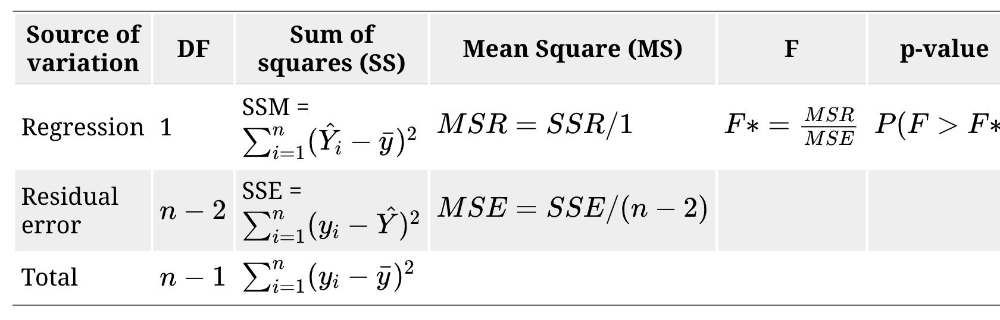

```{r setup, include=FALSE}
options(htmltools.dir.version = FALSE)
```

## Analysis of Variance (ANOVA)

- a statistical method that separates observed variance in a response variable (continuous random variable) into different components to use for additional tests.

- an approach to **test significance of regression** - if there is a **linear relationship** between the response $Y$ and any of the regressor variables $X_1, X_2, ...X_p$

- often thought of as an overall or global test of model adequacy.
---

## ANOVA table

Source of variation | DF | Sum of squares (SS) | Mean Square (MS) | F| p-value |
---:---:---:---:---:---|
Regression | 1| SSM = $\sum_{i=1}^{n}(\hat{Y_i}-\bar{y})^2$| MSR = $\frac{SSR}{1}$ | $F* =\frac{MSR}{MSE}$ | $P(F>F*)$|
Residual error | $n-2$ | SSE = $\sum_{i=1}^{n}(y_i-\hat{Y})^2$| MSE = $\frac{SSE}{(n-2)}$ | |
Total | $n-1$ | $\sum_{i=1}^{n}(y_i-\bar{y})^2$ | | | |

### Hypotheses

$H_0: \beta_1 = \beta_2 = ... = \beta_p = 0$

$H_1: \beta_j \neq 0 \text{ for at least one j, j=1, 2, ...p}$

The p -value of this test is not the same as the  p -value of the t-test for  $H_0: \beta_1 = 0$, that only happens in simple linear regression because $p=1$.

---

### Simple Linear Regression Analysis

Daughter's height vs Mother's height

```{r, comment=NA, message=FALSE, warning=FALSE}
library(alr3)
model <- lm(Dheight ~ Mheight, data=heights)
anova(model)
```



---
### Simple Linear Regression Analysis

Daughter's height vs Mother's height

```{r, comment=NA, message=FALSE, warning=FALSE, echo=FALSE}
library(alr3)
model <- lm(Dheight ~ Mheight, data=heights)
anova(model)
```

```{r, comment=NA}
dim(heights)
```

Demo:


---

## Simple Linear Regression Analysis - F test

### Hypothesis testing with ANOVA

```{r, comment=NA, message=FALSE, warning=FALSE, echo=FALSE}
library(alr3)
model <- lm(Dheight ~ Mheight, data=heights)
anova(model)
```

#### Test for significance of regression

.pull-left[


$Y = \beta_0 + \beta_1 X + \epsilon$

where 

$Y$ - daughter's height

$X$ - mother's height
]

.pull-right[

$H_0: \beta_1=0$

$H_1: \beta_1 \neq 0$

]

---

## Simple Linear Regression: F test vs t-test


```{r, comment=NA, message=FALSE, warning=FALSE}
summary(model)
```

---
class: duke-orange, center, middle

# Multiple Linear Regression Analysis

---

## Multiple Linear Regression Analysis

```{r, comment=NA, message=FALSE, warning=FALSE}
library(tidyverse)
heart.data <- read_csv("heart.data.csv")
heart.data
```


---
## Multiple Linear Regression Analysis - ANOVA

Source of variation | DF | Sum of squares (SS) | Mean Square (MS) | F| p-value |
---:---:---:---:---:---|
Regression | p| SSM = $\sum_{i=1}^{n}(\hat{Y_i}-\bar{y})^2$| MSR = $\frac{SSR}{p}$ | $F* =\frac{MSR}{MSE}$ | $P(F>F*)$|
Residual error | $n-p-1$ | SSE = $\sum_{i=1}^{n}(y_i-\hat{Y})^2$| MSE = $\frac{SSE}{(n-p-1)}$ | |
Total | $n-1$ | $\sum_{i=1}^{n}(y_i-\bar{y})^2$ | | | |

---

## Multiple Linear Regression Analysis - ANOVA

$Y$ - heart.disease

$X$ variables - biking and smoking

```{r, comment=NA, message=FALSE, echo=FALSE}
regHeart <-  lm(heart.disease ~ biking+ smoking, data=heart.data)

simpleAnova <- function(object, ...) {

  # Compute anova table
  tab <- anova(object, ...)

  # Obtain number of predictors
  p <- nrow(tab) - 1

  # Add predictors row
  predictorsRow <- colSums(tab[1:p, 1:2])
  predictorsRow <- c(predictorsRow, predictorsRow[2] / predictorsRow[1])

  # F-quantities
  Fval <- predictorsRow[3] / tab[p + 1, 3]
  pval <- pf(Fval, df1 = p, df2 = tab$Df[p + 1], lower.tail = FALSE)
  predictorsRow <- c(predictorsRow, Fval, pval)

  # Simplified table
  tab <- rbind(predictorsRow, tab[p + 1, ])
  row.names(tab)[1] <- "Predictors"
  return(tab)

}

# Simplified ANOVA
simpleAnova(regHeart)

```

$Y = \beta_0 + \beta_1 X_1 + \beta_2 X_2 + \epsilon$

Your turn: Interpret the terms in the model

### Test for Significance of Regression

$H_0: \beta_1 = \beta_2 = 0$

$H_1: \beta_j \neq 0 \text{ for at least one j, j=1, 2}$


---

## Tests on Individual Regression Coefficients

### Partial or marginal test

test of the contribution of $X_j$ given the other regressors in the model.

```{r, comment=NA, message=FALSE, warning=F}
summary(regHeart)

```

---
## Tests on Individual Regression Coefficients (cont)
---
## Next Lecture

> More work - Multiple Linear Regression
---
class: center, middle


Acknowledgement

Introduction to Linear Regression Analysis, Douglas C. Montgomery, Elizabeth A. Peck, G. Geoffrey Vining

Data from

https://www.scribbr.com/statistics/multiple-linear-regression/

All rights reserved by 

[Dr. Thiyanga S. Talagala](https://thiyanga.netlify.app/) 


