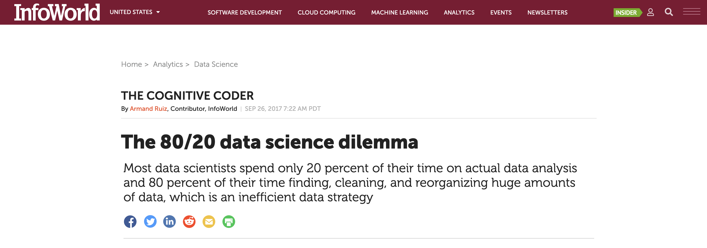
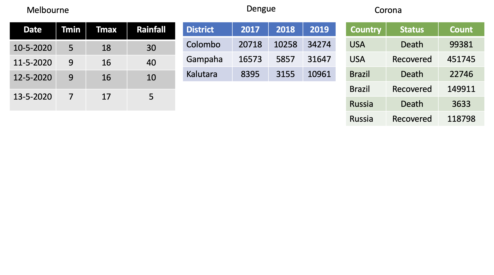
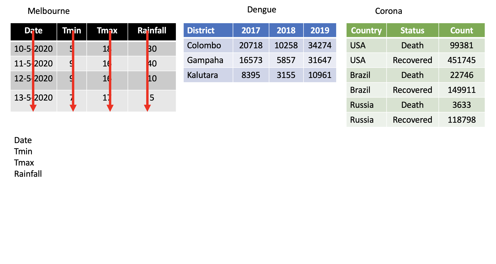

```{r setup, include=FALSE}
options(htmltools.dir.version = FALSE)
```

# Outline

1. Basics of R Programming ✅

2. Data Import ⚙️

3. Data Wrangling

4. Data Visualization


---
class: duke-green, center, middle
# Data Import


---
# Setup

```r
install.packages("tidyverse") # install tidyverse packages
library(tidyverse) # load tidyverse packages

```


---
# Tibble

- Tibbles are data frames.

- A modern re-imagining of data frames.


# Create a tibble

```{r, comment=NA, message=FALSE}
library(tidyverse) # library(tibble)
first.tbl <- tibble(height = c(150, 200, 160), weight = c(45, 60, 51))
first.tbl
```

```{r, comment=NA, message=FALSE}
class(first.tbl)
```

---
# tibble vs. data.frame

- Output

**tibble**

```{r, comment=NA}
first.tbl <- tibble(height = c(150, 200, 160), weight = c(45, 60, 51))
first.tbl
```

**data.frame**
```{r, comment=NA}
dataframe <- data.frame(height = c(150, 200, 160), weight = c(45, 60, 51))
dataframe
```
---
# tibble vs. data.frame (cont.)

- You can create new variables that are functions of existing variables.

**tibble**

```{r, comment=NA}
first.tbl <- tibble(height = c(150, 200, 160), weight = c(45, 60, 51), 
                    bmi = (weight)/height^2)
first.tbl
```

**data.frame**

```{r, comment=NA, eval=FALSE}
df <- data.frame(height = c(150, 200, 160), weight = c(45, 60, 51), 
                    bmi = (weight)/height^2) # Not working
```

You will get an error message 

<span style="color:red">`Error in data.frame(height = c(150, 200, 160), weight = c(45, 60, 51),  : 
  object 'height' not found.`</span>

---

# Pipe operator: %>%

## Required package: `magrittr` 

```{r, eval=FALSE, message=FALSE, warning=FALSE}
install.packages("magrittr")
library(magrittr)
```

```{r, echo=FALSE, message=FALSE, warning=FALSE}
library(magrittr)
```

## What does it do? 

It takes whatever is on the left-hand-side of the pipe and makes it the first argument of whatever function is on the right-hand-side of the pipe.


For instance,

```{r, comment=NA}
mean(1:10)
```

can be written as

```{r, comment=NA}
1:10 %>% mean()
```

---
# 🛠 Import data from a .csv file


```r
datasetname <- read_csv("include_file_path")
```

When you run `read_csv`, it prints out the names and type of each column.

.full-width[.content-box-yellow[Demo: Switch to R]]


# 🛠 Importing csv file from a website

## Syntax

```r
datasetname <- read_csv("include url here")
```

## Example

```{r, comment=NA, cache=TRUE, eval=FALSE}
url <- "https://thiyanga.netlify.app/project/datasets/foodlabel.csv"
foodlabel <- read_csv(url)
```

```{r,comment=NA, eval=FALSE}
head(foodlabel, 1)
```
---
# 🛠 Writing to a File

- We can save tibble (or dataframe) to a csv file, using `write_csv()`.

- `write_csv()` is in the `readr` package.


## Syntax

```r
write_csv(name_of_the_data_set_you_want_to_save, "path_to_write_to")
```

## Example

```r
data(gapminder)
# This will save inside your project folder
write_csv(gaominder, "gapminder.csv") 
# This will save inside the data folder which is inside your project folder
write_csv(gapminder, "data/gapminder.csv") 
```

.full-width[.content-box-yellow[Demo: Switch to R]]


---

# 🛠 Importing Excel .xlsx files

## Syntax

```r
library(readxl)
mydata <- read_xlsx("file_path")
```

.full-width[.content-box-yellow[Demo: Switch to R]]


---
# Outline

1. Basics of R Programming ✅

2. Data Import ✅

3. Data Wrangling ⚙️

4. Data Visualization


---
class: duke-green, center, middle
# Data Wrangling


---
# Data Wrangling/ Data Munging



--
# Reshaping Data (tidying your data)

How to reshape your data in order to make the analysis easier. 

---
# Tidy Data


- Each variable is saved in its column.

- Each observation is saved in its own row.

.footer-note[.tiny[.green[Image Credit: ][Hadley Wickham and Garrett Grolemund](https://r4ds.had.co.nz/tidy-data.html)]]


---

# packages


```{r, comment=NA, message=FALSE, warning=FALSE}
library(tidyverse) #or library(tidyr)
library(magrittr)
library(gapminder)
```

 
---

# `tidyr` package

Hadley Wickham (Chief Scientist at RStudio) is explaining tidyr at WOMBAT organized by Monash University, Australia.


.footer-note[.tiny[.green[Image rights: ][Thiyanga S Talagala](https:thiyanga.netlify.app)]]
---


---

---

---

---

---
background-image: url(tidyr.jpeg)
background-size: 100px
background-position: 98% 6%

# tidyr verbs

## Main verbs

- `pivot_longer`

    In tidyr (2014) `gather`

- `pivot_wider`

    In tidyr (2014) `spread`

## Other

- `separate`

- `unite`

## Input and Output 

Main input: `data frame` or `tibble`.

Output: `tibble`

---
class: duke-orange, center, middle

# `pivot_longer`
---
# `pivot_longer()`

- Turns columns into rows.

- From wide format to long format.


---
## `pivot_longer()`

```{r, comment=NA, warning=FALSE, message=FALSE}
dengue <- tibble( dist = c("Colombo", "Gampaha", "Kalutara"), 
                  '2017' = c(20718, 10258, 34274), 
                  '2018' = c(16573, 5857, 31647), 
                  '2019' = c(8395, 3155, 10961)); dengue
```

```{r, comment=NA, warning=FALSE, message=FALSE}
dengue %>% 
  pivot_longer(2:4, names_to="Year", values_to = "Dengue counts")
```

---
class: duke-orange, center, middle

# `pivot_wider`

---

# `pivot_wider()` 

- From long to wide format.


---

# `pivot_wider()` 


```{r, comment=NA}
Corona <- tibble(
country = rep(c("USA", "Brazil", "Russia"), each=2),
status = rep(c("Death", "Recovered"), 3),
count = c(99381, 451745, 22746, 149911, 3633, 118798))
```


```{r, comment=NA}
Corona 
```

---

# `pivot_wider()` 

.pull-left[
```{r, comment=NA}
Corona 
```
]

.pull-right[

```{r, comment=NA, message=FALSE, warning=FALSE}
Corona %>% 
  pivot_wider(names_from=status, 
              values_from=count)

```


]


---

# Assign a name:

```r
*corona_wide_format <- Corona %>% 
  pivot_wider(names_from=status, 
  values_from=count)
*corona_wide_format

```


```{r, comment=NA, message=FALSE, warning=FALSE, echo=FALSE}
corona_wide_format <- Corona %>% 
  pivot_wider(names_from=status, 
              values_from=count)
corona_wide_format 

```

---

# `pivot_longer` vs `pivot_wider`


---
# `pivot_longer` and `pivot_wider`

```{r, comment=NA}
profit <- tibble(
year = c(2015, 2015, 2015, 2015, 2016, 2016, 2016),
quarter = c( 1, 2, 3, 4, 2, 3, 4),
income = c(2, NA, 3, NA, 4, 5, 6)
)
profit
```
---
# `pivot_longer` and `pivot_wider` 

```{r, comment=NA, echo=FALSE, comment=NA}
profit <- tibble(
year = c(2015, 2015, 2015, 2015, 2016, 2016, 2016),
quarter = c( 1, 2, 3, 4, 2, 3, 4),
income = c(2, NA, 3, NA, 4, 5, 6)
)
profit
```

```{r, comment=NA, message=FALSE, warning=FALSE}
profit %>%
pivot_wider(names_from = year, values_from = income)
```
---

# Missing values

```{r, comment=NA, message=FALSE, warning=FALSE, echo=FALSE}
profit %>%
pivot_wider(names_from = year, values_from = income)
```

```r
profit %>%
pivot_wider(names_from = year, values_from = income) %>%
*pivot_longer(
*cols = c(`2015`, `2016`),
*names_to = "year",
*values_to = "income",
*values_drop_na = TRUE
)
```

```{r, echo=FALSE, comment=NA, message=FALSE}
profit %>%
pivot_wider(names_from = year, values_from = income) %>%
pivot_longer(
cols = c(`2015`, `2016`),
names_to = "year",
values_to = "income",
values_drop_na = TRUE
)
```


---
background-image: url(dplyr.png)
background-size: 100px
background-position: 98% 6%


# `dplyr` verbs

- `filter`

- `select`

- `mutate`

- `summarise`

- `arrange`

- `group_by`

- `rename`

---
background-image: url(dplyr.png)
background-size: 70px
background-position: 98% 6%


# `filter`

- Picks observations by their values.

- Takes logical expressions and returns the rows for which all are `TRUE`.

```{r, comment=NA, message=FALSE}
filter(gapminder, lifeExp < 50)
```

---
background-image: url(dplyr.png)
background-size: 70px
background-position: 98% 6%

# `filter` (cont)


```{r, comment=NA, message=FALSE}
filter(gapminder, country == "Sri Lanka")
# gapminder %>% filter(country == "Sri Lanka")
```

---
background-image: url(dplyr.png)
background-size: 70px
background-position: 98% 6%

# `filter` (cont)


```{r, comment=NA, message=FALSE}
filter(gapminder, country %in% c("Sri Lanka", "Australia"))
```

---
background-image: url(dplyr.png)
background-size: 70px
background-position: 98% 6%

# `filter` (cont)

```r
filter(gapminder, country %in% c("Sri Lanka", "Australia")) %>%
* head()
```

```{r, comment=NA, message=FALSE, echo=FALSE}
filter(gapminder, country %in% c("Sri Lanka", "Australia")) %>%
 head()
```

```r
filter(gapminder, country %in% c("Sri Lanka", "Australia")) %>%
* tail()
```

```{r, comment=NA, message=FALSE, echo=FALSE}
filter(gapminder, country %in% c("Sri Lanka", "Australia")) %>%
 tail()
```
---
background-image: url(dplyr.png)
background-size: 70px
background-position: 98% 6%

# `select`

- Picks variables by their names.


```{r, comment=NA, message=FALSE}
head(gapminder, 3)
```

```{r, comment=NA, message=FALSE, warning=FALSE}
select(gapminder, year:gdpPercap)
```

---
background-image: url(dplyr.png)
background-size: 70px
background-position: 98% 6%

# `select` (cont.)


```{r, comment=NA, message=FALSE}
head(gapminder, 3)
```

```{r, comment=NA, message=FALSE, warning=FALSE}
select(gapminder, year, gdpPercap)
```

---
background-image: url(dplyr.png)
background-size: 70px
background-position: 98% 6%

# `select` (cont.)


```{r, comment=NA, message=FALSE}
head(gapminder, 3)
```

```{r, comment=NA, message=FALSE, warning=FALSE}
select(gapminder, -c(year, gdpPercap))
```

---

background-image: url(dplyr.png)
background-size: 70px
background-position: 98% 6%

# `select` (cont.)


```{r, comment=NA, message=FALSE}
head(gapminder, 3)
```

```{r, comment=NA, message=FALSE, warning=FALSE}
select(gapminder, -(year:gdpPercap))
```


---
background-image: url(dplyr.png)
background-size: 70px
background-position: 98% 6%

# `mutate`

- Creates new variables with functions of existing variables

```{r, comment=NA, message=FALSE, warning=FALSE}
gapminder %>%
mutate(gdp = pop * gdpPercap)
```

---
background-image: url(dplyr.png)
background-size: 70px
background-position: 98% 6%

# `summarise`(British) or `summarize` (US)

- Collapse many values down to a single summary

```{r, comment=NA, message=FALSE, warning=FALSE}
gapminder %>%
  summarise(
    lifeExp_mean=mean(lifeExp),
    pop_mean=mean(pop),
    gdpPercap_mean=mean(gdpPercap))
```


---

background-image: url(dplyr.png)
background-size: 70px
background-position: 98% 6%

# `arrange`

- Reorder the rows

```{r, comment=NA, message=FALSE, warning=FALSE}
arrange(gapminder, desc(lifeExp))
```


---

background-image: url(dplyr.png)
background-size: 70px
background-position: 98% 6%

# `group_by`

- Takes an existing tibble and converts it into a grouped tibble where operations are performed "by group". ungroup() removes grouping.

```{r, comment=NA, message=FALSE, warning=FALSE}
Japan_SL <- filter(gapminder, country %in% c("Japan", "Sri Lanka"))
Japan_SL %>% head()
```


```{r, comment=NA, message=FALSE, warning=FALSE}
Japan_SL_grouped <- Japan_SL %>% group_by(country)
Japan_SL_grouped
```

---
background-image: url(dplyr.png)
background-size: 70px
background-position: 98% 6%

# `group_by` (cont.)


```{r, comment=NA, message=FALSE, warning=FALSE}
Japan_SL %>% summarise(mean_lifeExp=mean(lifeExp))
```


```{r, comment=NA, message=FALSE, warning=FALSE}
Japan_SL_grouped %>% summarise(mean_lifeExp=mean(lifeExp))
```


---
background-image: url(dplyr.png)
background-size: 70px
background-position: 98% 6%

# `rename`

- Rename variables

```{r, comment=NA, message=FALSE}
head(gapminder, 3)
```


```{r, comment=NA, message=FALSE, warning=FALSE}
rename(gapminder,
       `life expectancy`=lifeExp,
       population=pop) # new_name = old_name
```

---
background-image: url(dplyr.png)
background-size: 70px
background-position: 98% 6%

# Combine multiple operations


```{r, comment=NA, message=FALSE}
gapminder %>%
filter(country == 'China') %>% head(2)
```


```{r, comment=NA, message=FALSE}
gapminder %>%
filter(country == 'China') %>% summarise(lifemax=max(lifeExp))
```

```r
gapminder %>%
filter(country == 'China') %>%
*filter(lifeExp == max(lifeExp))
```

```{r, comment=NA, message=FALSE, echo=FALSE}
gapminder %>%
filter(country == 'China') %>%
filter(lifeExp == max(lifeExp))
```

---
background-image: url(dplyr.png)
background-size: 70px
background-position: 98% 6%

# Combine multiple operations

```{r, comment=NA}
gapminder %>%
filter(continent == 'Asia') %>%
group_by(country) %>%
filter(lifeExp == max(lifeExp)) %>%
arrange(desc(year))
```

---

class: duke-orange, center, middle

# Combine Data Sets


---

# Combine Data Sets

.pull-left[
## Mutating joins

- `left_join`

- `right_join`

- `inner_join`

- `full_join`

## Set operations

- `intersect`

- `union`

]

.pull-right[

## Binding

- `bind_rows`

- `bind_cols`

]

---
# `left_join`

```{r, comment=NA, message=FALSE, warning=FALSE}
first <- tibble(x1=c("A", "B", "C"), x2=c(1, 2, 3))
second <- tibble(x1=c("A", "B", "D"), x3=c("red", "yellow" , "green"))
```

.pull-left[

```{r, comment=NA, message=FALSE}
first
second

```

]

.pull-right[

```{r, comment=NA, message=FALSE}
left_join(first, second, by="x1")
```
]

---
# `right_join`

```{r, comment=NA, message=FALSE, warning=FALSE}
first <- tibble(x1=c("A", "B", "C"), x2=c(1, 2, 3))
second <- tibble(x1=c("A", "B", "D"), x3=c("red", "yellow" , "green"))
```

.pull-left[

```{r, comment=NA, message=FALSE}
first
second

```

]

.pull-right[

```{r, comment=NA, message=FALSE}
right_join(first, second, by="x1")
```
]
---
# `inner_join`

```{r, comment=NA, message=FALSE, warning=FALSE}
first <- tibble(x1=c("A", "B", "C"), x2=c(1, 2, 3))
second <- tibble(x1=c("A", "B", "D"), x3=c("red", "yellow" , "green"))
```

.pull-left[

```{r, comment=NA, message=FALSE}
first
second

```

]

.pull-right[

```{r, comment=NA, message=FALSE}
inner_join(first, second, by="x1")
```
]
---

# `full_join`

```{r, comment=NA, message=FALSE, warning=FALSE}
first <- tibble(x1=c("A", "B", "C"), x2=c(1, 2, 3))
second <- tibble(x1=c("A", "B", "D"), x3=c("red", "yellow" , "green"))
```

.pull-left[

```{r, comment=NA, message=FALSE}
first
second

```

]

.pull-right[

```{r, comment=NA, message=FALSE}
full_join(first, second, by="x1")
```
]
---
# Set operations


```{r, comment=NA, message=FALSE, warning=FALSE}
first <- tibble(x1=c("A", "B", "C"), x2=c(1, 2, 3))
second <- tibble(x1=c("D", "B", "C"), x2=c(10, 2, 3))
```

.pull-left[

Two compatible data sets. Column names are the same.

```{r, comment=NA, message=FALSE}
first
second

```

]

.pull-right[
**intersect**
```{r, comment=NA, message=FALSE}
intersect(first, second)
```

**union**
```{r, comment=NA, message=FALSE}
union(first, second)
```
]

---

# Set operations (cont.)

```r
first <- tibble(x1=c("A", "B", "C"), x2=c(1, 2, 3))
*second <- tibble(x1=c("D", "B", "C"), x2=c(10, 20, 30))
```

```{r, comment=NA, message=FALSE, warning=FALSE, echo=FALSE}
first <- tibble(x1=c("A", "B", "C"), x2=c(1, 2, 3))
second <- tibble(x1=c("D", "B", "C"), x2=c(10, 20, 30))
```

.pull-left[

Two compatible data sets. Column names are the same.

```{r, comment=NA, message=FALSE}
first
second

```

]

.pull-right[
**intersect**
```{r, comment=NA, message=FALSE}
intersect(first, second)
```

**union**
```{r, comment=NA, message=FALSE}
union(first, second)
```
]

---

# Binding


```{r, comment=NA, message=FALSE, warning=FALSE}
first <- tibble(x1=c("A", "B", "C"), x2=c(1, 2, 3))
second <- tibble(x1=c("D", "B", "C"), x2=c(10, 20, 30))
```

.pull-left[


```{r, comment=NA, message=FALSE}
first
second

```

]

.pull-right[
**bind_rows**
```{r, comment=NA, message=FALSE}
bind_rows(first, second)
```


]

---
# Binding (cont.)


```{r, comment=NA, message=FALSE, warning=FALSE}
first <- tibble(x1=c("A", "B", "C"), x2=c(1, 2, 3))
second <- tibble(x1=c("D", "B", "C"), x2=c(10, 20, 30))
```

.pull-left[


```{r, comment=NA, message=FALSE}
first
second

```

]

.pull-right[
**bind_cols**
```{r, comment=NA, message=FALSE}
bind_cols(first, second)
```
]

---

background-image: url('dplyrcs1.png')
background-position: center
background-size: contain

---

background-image: url('dplyrcs2.png')
background-position: center
background-size: contain

---

# What have we learned today?

---
class: center, middle


All rights reserved by 

[Dr. Thiyanga S. Talagala](https://thiyanga.netlify.app/) 

and 

[Dr. Chitraka Wickramarachchi](http://science.sjp.ac.lk/sta/staff/mr-chitraka-wickramarachchi/)


