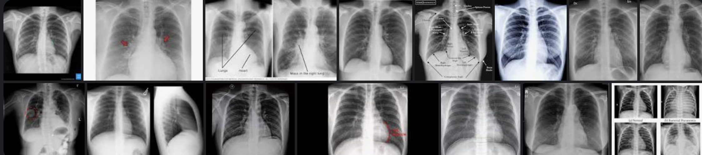
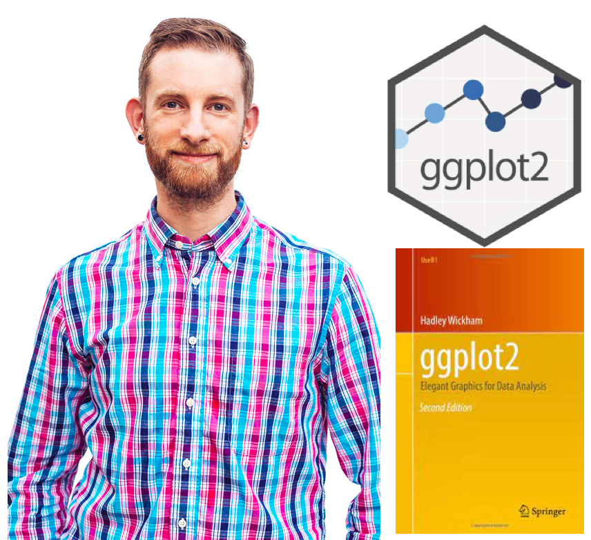
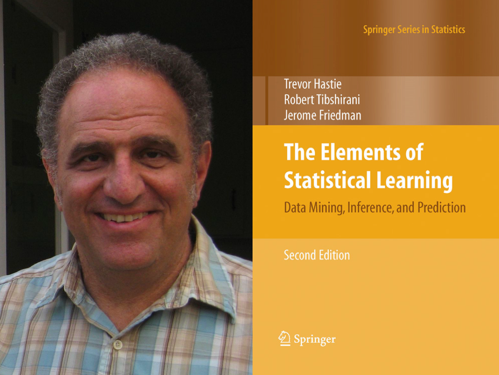
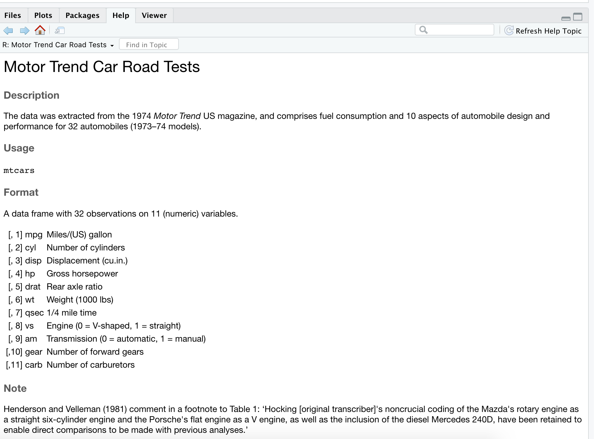

class: middle, left 


```{r setup, include=FALSE}
options(htmltools.dir.version = FALSE)
knitr::opts_chunk$set(
  out.width = "100%",
  cache = FALSE,
  echo = TRUE,
  message = FALSE, 
  warning = FALSE,
  fig.show = TRUE,
  hiline = TRUE
)
```

<style type="text/css">
.remark-slide-content {
    font-size: 45px;
}
</style>


# What is Statistics?

--
The science of collecting, analyzing, presenting, and interpreting data. 

---

class: center, middle

# What is Statistics?

The science of collecting, analyzing, presenting, and interpreting **data**.

---

.pull-left[


]


---

.pull-left[


]

.pull-right[


]


---


.pull-left[

**Tabular data**


]

.pull-right[


]

---
background-image: url(i4.png)
background-size: contain


---


.pull-left[

Tabular data


]

.pull-right[

**Image data**




]

---


.pull-left[

Tabular data


**Audio data**


]

.pull-right[

Image data


]


---


.pull-left[

Tabular data


Audio data


]

.pull-right[

Image data


**Video data**

<iframe width="560" height="315" src="https://www.youtube.com/embed/398Zcag0Pw8" title="YouTube video player" frameborder="0" allow="accelerometer; autoplay; clipboard-write; encrypted-media; gyroscope; picture-in-picture" allowfullscreen></iframe>

]


---

class: center, middle

# What is Statistics?

The science of **collecting**, analyzing, presenting, and interpreting **data**.

---

class: center, middle

# What is Statistics?

The science of collecting, **analyzing**, presenting, and interpreting **data**.

---
background-image: url(orange.jpeg)
background-size: cover

# Data analysis

---

.pull-left[

```{r, comment=NA, echo=FALSE}
ID <- 1:100
g1 <- c("Male", "Female", "Female", "Female", "Female", "Male", "Male", "Male") 
Gender <- c(g1, rep("Female", 46), rep("Male", 46))
set.seed(1)
b2 <- rnorm(46, mean=3.5) 
b3 <- rnorm(46, mean=3)
w2 <- 1000*b2 + rnorm(46, mean=100)
w3 <- 1500*b3 + rnorm(46, mean=100)
b1 <- c(3.6, 2.5, 4, 4.5, 3, 3.9, 4.2, 4.6)
w1 <- c(4000, 5000, 6000, 7000, 7550, 4500, 3375, 5500)
B <- round(c(b1, b2, b3), 1)
Weight <- round(c(w1, w2, w3), 0)
a1 <- c(80, 90, 110, 100, 91.5, 92, 88, 70) 
a2 <- rnorm(92, mean=100)
A <- round(c(a1, a2), 1)
c1 <- c(2.5, 6.3, 4.5, 3.2, 3.5, 3.7, 3.8, 3.9)
c2 <- rnorm(92, mean=3.5)
C <- round(c(c1, c2), 1)
df <- data.frame(ID, Gender, A, B, C, Weight)
df
```
]

--

.pull-right[

```{r, echo=FALSE, comment=NA, warning=FALSE, message=FALSE}

library(ggplot2)
ggplot(data=df, aes(x=B, y=Weight)) + 
  geom_point() + ggtitle("Scatterplot of weight (kg) vs B (ft)") +
  xlab("B (ft)") + ylab("Weight (kg)") + theme(plot.title = element_text(hjust = 0.5))
```

]


---

.pull-left[

```{r, comment=NA, echo=FALSE}
ID <- 1:100
g1 <- c("Male", "Female", "Female", "Female", "Female", "Male", "Male", "Male") 
Gender <- c(g1, rep("Female", 46), rep("Male", 46))
set.seed(1)
b2 <- rnorm(46, mean=3.5) 
b3 <- rnorm(46, mean=3)
w2 <- 1000*b2 + rnorm(46, mean=100)
w3 <- 1500*b3 + rnorm(46, mean=100)
b1 <- c(3.6, 2.5, 4, 4.5, 3, 3.9, 4.2, 4.6)
w1 <- c(4000, 5000, 6000, 7000, 7550, 4500, 3375, 5500)
B <- round(c(b1, b2, b3), 1)
Weight <- round(c(w1, w2, w3), 0)
a1 <- c(80, 90, 110, 100, 91.5, 92, 88, 70) 
a2 <- rnorm(92, mean=100)
A <- round(c(a1, a2), 1)
c1 <- c(2.5, 6.3, 4.5, 3.2, 3.5, 3.7, 3.8, 3.9)
c2 <- rnorm(92, mean=3.5)
C <- round(c(c1, c2), 1)
df <- data.frame(ID, Gender, A, B, C, Weight)
df
```
]


.pull-right[

```{r, echo=FALSE, comment=NA, warning=FALSE, message=FALSE}

library(ggplot2)
p1 <- ggplot(data=df, aes(x=B, y=Weight, col=Gender)) + 
  geom_point() + 
  ggtitle("Scatterplot of weight (kg) vs B (ft)")+
  xlab("B (ft)") + ylab("Weight (kg)") + theme(plot.title = element_text(hjust = 0.5)) + scale_colour_manual(values = c("#e7298a","#1b9e77", "green"))
p1
```

]


---

.pull-left[

```{r, comment=NA, echo=FALSE}
ID <- 1:100
g1 <- c("Male", "Female", "Female", "Female", "Female", "Male", "Male", "Male") 
Gender <- c(g1, rep("Female", 46), rep("Male", 46))
set.seed(1)
b2 <- rnorm(46, mean=3.5) 
b3 <- rnorm(46, mean=3)
w2 <- 1000*b2 + rnorm(46, mean=100)
w3 <- 1500*b3 + rnorm(46, mean=100)
b1 <- c(3.6, 2.5, 4, 4.5, 3, 3.9, 4.2, 4.6)
w1 <- c(4000, 5000, 6000, 7000, 7550, 4500, 3375, 5500)
B <- round(c(b1, b2, b3), 1)
Weight <- round(c(w1, w2, w3), 0)
a1 <- c(80, 90, 110, 100, 91.5, 92, 88, 70) 
a2 <- rnorm(92, mean=100)
A <- round(c(a1, a2), 1)
c1 <- c(2.5, 6.3, 4.5, 3.2, 3.5, 3.7, 3.8, 3.9)
c2 <- rnorm(92, mean=3.5)
C <- round(c(c1, c2), 1)
df <- data.frame(ID, Gender, A, B, C, Weight)
df
```
]


.pull-right[

```{r, echo=FALSE, comment=NA, warning=FALSE, message=FALSE}
library(plotly)
ggplotly(p1)
```

]

---
background-image: url(i7.png)
background-size: cover

---

class: center, middle

# What is Statistics?

The science of collecting, analyzing, **presenting, and interpreting** **data**.


---
class: center, middle

# Myth-busting Statistics

--

Popular Myths (**false beliefs**) about statistics

---
class: inverse, center, middle

**Myth 1**

**Statistics is a boring subject.**


---
class: inverse, center, middle

~~**Myth 1**~~

**Statistics is a** ~~**boring subject**~~.


 # **Statistics is a** very interesting and useful subject with so many applications.
 
---
background-image: url(i8.png)
background-size: contain


---
background-image: url(i9.jpeg)
background-size: contain

---
background-image: url(l2.png)
background-size: contain

---
background-image: url(l1.png)
background-size: contain

---
background-image: url(bp.jpg)
background-size: contain

---
background-image: url(s1.png)
background-size: contain

---
background-image: url(sydney.jpg)
background-size: contain

---
# Your Turn

## Assignment 1

Application of statistics in your field. 

Method of evaluation: 1 slide

Time: 3 minutes

Upload your video recording to the LMS

Marks: 10 marks


---
class: inverse, center, middle

**Myth 2**

**Statistics hasn't changed much in years. It is just the same old stuff.**


---
class: inverse, center, middle

~~**Myth 2**~~

~~**Statistics hasn't changed much in years. It is just the same old stuff.**~~

## The field of statistics has evolved significantly over time. It has also become a main componenet of many other disciplines.

---

# Ross Ihaka and Robert Gentleman

.pull-left[
```{r  echo=FALSE, out.height= "100%", fig_align = 'up'}
knitr::include_graphics("rr.jpg")
```

 ]
 
.pull-right[

- Originators of the R programming language

- R is a free software environment for statistical computing and graphics


]

---
# Hadley Wickham: Chief Scientist at RStudio

.pull-left[
```{r  echo=FALSE, out.width= "100%"}

```
 ]
.pull-right[


- International COPSS Presidents' Award in 2019 for "influential work in statistical computing, visualisation, graphics, and data analysis"
]


---

# Robert Tibshirani

.pull-left[
```{r  echo=FALSE, out.width= "100%"}

```
 ]
.pull-right[

-  Professor in Statistics and Biomedical Data Science at Stanford University


- Received the COPSS Presidents' Award in 1996
]

---
# Trevor Hastie

.pull-left[
```{r  echo=FALSE, out.width= "100%"}
knitr::include_graphics("TrevorHastie.png")
```
 ]
.pull-right[

- Hastie is known for his contributions to applied statistics, especially in the field of machine learning, data mining, and bioinformatics.


]

---

# Andrew Ng

.pull-left[
```{r  echo=FALSE, out.width= "70%", fig_align = 'up'}
knitr::include_graphics("Andrew_Ng.jpg")
```
 ]
.pull-right[

-  Undergraduate degree with a triple major in computer science, **statistics**, and economics

- Co-founded and led Google Brain, Coursera and deeplearning.ai


]


---
background-image: url(f1.png)
background-size: contain

## Data Science

---
background-image: url(f2.png)
background-size: contain

## Data Science

---
background-image: url(f3.png)
background-size: contain

## Data Science


---
## Statistics

- Descriptive statistics/ Exploratory Data Analysis (EDA)

> Use of graphical and numerical summaries to highlight the key features of data.

- Inferential statistics

> Techniques  for drawing conclusions about a population by examining random samples 

---

## Example

Objective: Design a new chair for the university lecture halls

Wants to identify right handed left handed count


---
## Population

A population is a complete collection of individuals/ objects that we are interested in.

## Sample

 A sample is a subset of a population.
 
---

## Parameter

A parameter is a descriptive measure(numerical value) of the population. Parameters are usually denoted by Greek letters.

$\theta$ - population proportion

$\mu$ - population mean

---

## Statistic

A statistic is a descriptive measure of a sample. For example, sample mean, sample standard deviation, etc. We will talk about the notations under estimator and estimate.

---
## Variables

**1. Qualitative/ Categorical**

- Nominal, Ordinal

**2. Quantitative/ Numerical**

- Discrete, Continuous

---
## Your turn

```{r}
data("mtcars")
mtcars
```

---
## Your turn

.pull-left[
```{r}
data("mtcars")
mtcars
```

]

.pull-right[



]

---

## Descriptive Statistics

- Data visualization: Graphics

- Numerical measures

  - We are using R software for data analysis and modeling
  

---

# What is R? 

- R is a software environment for statistical computing and graphics

- Language designers: **R**oss Ihaka and **R**obert Gentleman at the University of Auckland, New Zealand

- Parent language: S

- The latest R version 3.6.2 has been released on 2019-12-12

---

# Why R?

- **Free**

- **Powerful:** Over 18000 contributed packages on the main repository (CRAN), as of July 2022, provided by top international researchers and programmers

- **Flexible:** It is a language, and thus allows you to create your own solutions

- **Community:** Large global community friendly and helpful, lots of resources

---
Numerical summary measures

```{r}
summary(mtcars)
```

---
Numerical summary measures (cont.)

```{r, echo=FALSE}
summary(mtcars)
```

---
.pull-left[

### Measures of central tendancy

- Mean

- Median

- Mode

]


.pull-right[

### Measures of dispersion

- Range

- Inter quartile range

- Variance

- Standard deviation

]
---


background-image: url('renv.png')
background-position: center
background-size: contain

## R environment
---

background-image: url('rstudio1.png')
background-position: center
background-size: contain

## The RStudio IDE
---

background-image: url('rstudio2.png')
background-position: center
background-size: contain

## The RStudio IDE

.footer-note[.tiny[.green[Image Credit: ][Clastic Detritus ](https://clasticdetritus.com/2013/01/10/creating-data-plots-with-r/)]]
---

background-image: url('airport.jpg')
background-position: center
background-size: cover

.content-box-yellow[
## R and RStudio
]

.footer-note[.tiny[.green[Image Credit: ][Clastic Detritus ](https://clasticdetritus.com/2013/01/10/creating-data-plots-with-r/)]]
---


background-image: url('airport.jpg')
background-position: center
background-size: cover

.content-box-yellow[
## R and RStudio

]

.footer-note[.tiny[.green[Image Credit: ][Clastic Detritus ](https://clasticdetritus.com/2013/01/10/creating-data-plots-with-r/)]]

---


"If R were **an airplane**, RStudio would be **the airport**, providing many, many supporting services that make it easier for you, the pilot, to take off and go to awesome places. Sure, you can fly an airplane without an airport, but having those runways and supporting infrastructure is a game-changer." 

-- Julie Lowndes


---

class: inverse, center, middle

# Create a new project

---
background-image: url('project1.png')
background-position: center
background-size: contain
---

background-image: url('project2.png')
background-position: center
background-size: contain
---

background-image: url('project3.png')
background-position: center
background-size: contain
---

background-image: url('project4.png')
background-position: center
background-size: contain
---

background-image: url('project5.png')
background-position: center
background-size: contain
---
background-image: url('project6.png')
background-position: center
background-size: contain
---

## R Console

```{r, comment=NA}
7+1

```


```{r, comment=NA}
rnorm(10) 

```

---

## Variable assignment

```{r, comment=NA}
a <- rnorm(10)
a
```

--

```{r, comment=NA}
b <- a*100
b
```

---

# Data permanency

- `ls()` can be used to display the names of the objects which are currently stored within R.

- The collection of objects currently stored is called the **workspace**

```{r, comment=NA}
ls()

```

---

- To remove objects the function `rm` is available

    - remove all objects `rm(list=ls())`
    
    - remove specific objects `rm(x, y, z)`
    
    
```{r, comment=NA}
rm(a)
ls()
```

```{r, comment=NA}
rm(list=ls())
ls()
```

---

background-image: url('project7.png')
background-position: center
background-size: contain

--
.pull-left[.full-width[.content-box-yellow[**At the end of an R session, if save: the objects are written to a file called .RData in the current directory, and the command lines used in the session are saved to a file called .Rhistory**]]]

---

background-image: url('p81.png')
background-position: center
background-size: cover

.pull-left[.full-width[.content-box-yellow[When R is started at later time **from the same directory** ]]]

---
background-image: url('p82.png')
background-position: center
background-size: cover

.pull-left[.full-width[.content-box-yellow[When R is started at later time **from the same directory** it reloads the **associated workspace** and **commands history.**]]]

---

background-image: url('project9.png')
background-position: center
background-size: cover

--
.pull-left[.full-width[.content-box-yellow[When R is started at later time **from the same directory** it reloads the **associated workspace** and **commands history.**]]]

---

## Comment your code

- Each line of a comment should begin with the comment symbol and a single space: # . 

```{r, comment=NA}
rnorm(10) # This is a comment 
sum(1:10) # 1+2
```

---

## Style Guide

- Good coding style is like correct punctuation: you can manage without it, butitsuremakesthingseasiertoread.  -- Hadley Wickham

```{r, comment=NA}
sum(1:10)#Bad commenting style
sum(1:10) # Good commenting style

```

- Also, use commented lines of - and = to break up your file into easily readable sub-sections.

```r
# Read data ----------------

# Plot data ----------------
```

To learn more read Hadley Wickham's [Style guide](http://adv-r.had.co.nz/Style.html).

---

## Objects in R

- R is an [object-oriented language](https://en.wikipedia.org/wiki/Object-oriented_programming).

--
- An object in R is anything (data structures, functions, etc., that can be assigned to a variable).

---

Let's take a look of some common types of objects.

--

**1. Data structures** are the ways of arranging data.

  - You can create objects, using the left pointing arrow <-
---

**2. Functions** tell R to do something.

  - A function may be applied to an object.

  - Result of applying a function is usually an object too.

    - All function calls need to be followed by parentheses.
    
---

## Example

```{r, comment=NA}
a <- 1:20 # data structure
sum(a) # sum is a function applied on a

```

```r
help.start() # Some functions work on their own.
```


---

# Getting help with functions and features

- R has inbuilt help facility


### Method 1

```r
help(rnorm)
```

- For a feature specified by special characters such as `for`, `if`, `[[`

```r
help("[[")
```

---

- Search the help files for a word or phrase.

```r
help.search(‘weighted mean’) 
```

### Method 2

```r
?rnorm
```

```r
??rnorm
```

---
background-image: url('dataStructures.png')
background-position: center
background-size: contain

## Data structures

.footer-note[.tiny[.green[Image Credit: ][venus.ifca.unican.es](http://venus.ifca.unican.es/Rintro/dataStruct.html)]]


---

## Data structures

Data structures differ in terms of,

- Type of data they can hold

- How they are created

- Structural complexity

- Syntax to identify and access individual elements

---
class: duke-green, center, middle

# 1. Vectors

---

# Vectors

- Vectors are one-dimensional arrays that can hold numeric data, character data, or logical data.

- Combine function c() is used to form the vector.

- Data in a vector must only be one type or mode (numeric, character, or logical). You can’t mix modes in the same vector.

---

## Vector assignment

**Syntax**

```r
vector_name <- c(element1, element2, element3)

```

```r
x <- c(5, 6, 3, 1 , 100)
```

- assignment operator ('<-'), '=' can be used as an alternative.

- `c()` function

---

.red[What will be the output of the following code?]

```r
y <- c(x, 500, 600)
```

---

# Types and tests with vectors


```{r, eval=TRUE}
first_vec <- c(10, 20, 50, 70)
second_vec <- c("Jan", "Feb", "March", "April")
third_vec <- c(TRUE, FALSE, TRUE, TRUE)
fourth_vec <- c(10L, 20L, 50L, 70L)
```


To check if it is a 

- vector: `is.vector()`

```{r, comment=NA}
is.vector(first_vec)
```

---

- charactor vector: `is.charactor()`

```{r, comment=NA}
is.character(first_vec)
```

- double: `is.double()`

```{r, comment=NA}
is.double(first_vec)
```

---

- integer: `is.integer()`

```{r, comment=NA}
is.integer(first_vec)
```


--

- logical: `is.logical()`

```{r, comment=NA}
is.logical(first_vec)
```

---

- length

```{r, comment=NA}
length(first_vec)
```
---

# Coercion

Vectors must be homogeneous. When you attempt to combine different types they will be coerced to the most flexible type so that every element in the vector is of the same type.

Order from least to most flexible

`logical` --> `integer` --> `double` --> `character`

---


```{r, comment=NA}
a <- c(3.1, 2L, 3, 4, "GPA") 
typeof(a) 
```

```{r, comment=NA}
anew <- c(3.1, 2L, 3, 4)
typeof(anew) 
```

---

### Explicit coercion

Vectors can be explicitly coerced from one class to another using the `as.*` functions, if available. For example, `as.charactor`, `as.numeric`, `as.integer`, and `as.logical`.

---


```{r, comment=NA}
vec1 <- c(TRUE, FALSE, TRUE, TRUE)
typeof(vec1)

vec2 <- as.integer(vec1)
typeof(vec2)
vec2
```

---

.red[Why does the below output NAs?]

```{r, comment=NA}
x <- c("a", "b", "c")
as.numeric(x)
```

---

.pull-left[

```{r, comment=NA}
x1 <- 1:3
x2 <- c(10, 20, 30)
combinedx1x2 <- c(x1, x2)
combinedx1x2 
```

]
--

.pull-right[

```{r, comment=NA}
class(x1)
class(x2)
class(combinedx1x2)

```

]


---

- If you combine a numeric vector and a character vector 

```{r, comment=NA}
y1 <- c(1, 2, 3)
y2 <- c("a", "b", "c")
c(y1, y2)

```

---

# Name elements in a vector

You can name elements in a vector in different ways. We will learn two of them.

When creating it

```{r}
x1 <- c(a=1991, b=1992, c=1993)
x1
```

---

Modifying the names of an existing vector

```{r}
x2 <- c(1, 5, 10)
names(x2) <- c("a", "b", "b")
x2
```

Note that the names do not have to be unique. 

---

# To remove names of a vector

Method 1

```{r, comment=NA}
unname(x1); x1
```

---

Method 2

```{r, comment=NA}
names(x2) <- NULL; x2
```

What will be the output of the following code?

```r
v <- c(1, 2, 3)
names(v) <- c("a")
v
```
---

### Simplifying vector creation

- colon `:` produce regular spaced ascending or descending sequences.

```{r, comment=NA}
 10:16

-0.5:8.5

```
---
- sequence: `seq(initial_value, final_value, increment)`

```{r, comment=NA}
seq(1,11)

seq(1, 11, length.out=5)

seq(0, 11, by=2)
```

---

- repeats `rep()` 

```{r, comment=NA}
rep(9, 5)

rep(1:4, 2)

rep(1:4, each=2) # each element is repeated twice
```

---

```{r, comment=NA}
rep(1:4, times=2) # whole sequence is repeated twice

rep(1:4, each=2, times=3)

rep(1:4, 1:4)

rep(1:4, c(4, 1, 4, 2))

```

---

## Logical operators

```{r, comment=NA}
c(1, 2, 3) == c(10, 20, 3)
```

```{r, comment=NA}
c(1, 2, 3) != c(10, 20, 3)
```

```{r, comment=NA}
1:5 > 3
```

---

```{r, comment=NA}
1:5 < 3
```

- `<=` less than or equal to

- `>=` greater than or equal to

- `|` or

- `&` and

---

# Operators: `%in%` - in the set

```{r, comment=NA}
a <- c(1, 2, 3)
b <- c(1, 10, 3)
a%in%b
```

```{r, comment=NA}
x <- 1:10
y <- 1:3
```

---

```{r, comment=NA}
x
y
x %in% y

```

```{r, comment=NA}
y %in% x
```
---
## Vector arithmetic


- operations are perfored element by element. 

```{r, comment=NA}
c(10, 100, 100) + 2 # two is added to every element in the vector
```
--
- operations between two vectors

```{r, comment=NA}
v1 <- c(1, 2, 3); v2 <- c(10, 100, 1000)
v1 + v2
```

---

Add two vectors of unequal length

```{r, comment=NA}
longvec <- seq(10, 100, length=10); shortvec <- c(1, 2, 3, 4, 5)

shortvec + longvec

```


.red[What will be the output of the following code?]

```r
first <- c(1, 2, 3, 4); second <- c(10, 100)
first * second
```
---

## References

Le Dinh, T., Lee, S. H., Kwon, S. G., & Kwon, K. R. (2022). COVID-19 Chest X-ray Classification and Severity Assessment Using Convolutional and Transformer Neural Networks. Applied Sciences, 12(10), 4861.

