```{r setup, include=FALSE}
knitr::opts_chunk$set(echo = TRUE)
```

# Predictive tasks vs Descriptive tasks

1. **Predictive tasks:** Predict the value of a particular attribute based on the values of other attributes

2. **Descriptive tasks:** Find human-interpretable patterns that describe data

# Data


## Variables: Characteristic of an object

Features, Attributes, Dimension, Field

## Object: Collection of attributes describe an object

Entity, Instance, Event case, Record, Observation 

# Data Quality

1. Range: How narrow or wide of the scope of these data?

2. Relevancy: Is the data relevant to the problem?

3. Recency: How recent the data is generated?

4. Robustness: Signal to noise ratio

5. Reliability: How accurate?

# Applications 

1. Web mining: recommendation systems

2. Screening images: Early warning of ecological disasters 

3. Marketing and sales

4. Diagnosis

5. Load forecasting

6. Decision involving judgement

Many more...

# Machine Learning Algorithms

1. Supervised learning algorithms

    Deals with labelled dataset

2. Unsupervised learning algorithm

    Deals with labelled dataset

# Loss function

- Function that calculates loss for a single data point

$e_i = y - \hat{y}$

$e_i^2 = (y - \hat{y})^2$

# Cost function

- Calculates loss for the entire data sets 


# Prediction accuracy measures (cost functions)

## Mean Error

$$ME = \frac{1}{n}\sum_{i=1}^n e_i$$


- Error can be both negative and positive. So they can cancel each other during the summation.

## Mean Absolute Error (L1 loss)

$$MAE = \frac{1}{n}\sum_{i=1}^n |e_i|$$

##  Mean Squared Error (L2 loss)

$$MSE = \frac{1}{n}\sum_{i=1}^n e^2_i$$


## Mean Percentage Error

$$MPE = \frac{1}{n}\sum_{i=1}^n \frac{e_i}{y_i}$$


## Mean Absolute Percentage Error

$$MAPE = \frac{1}{n}\sum_{i=1}^n |\frac{e_i}{y_i}|$$


## Root Mean Squared Error

$$RMSE = \sqrt{\frac{1}{n}\sum_{i=1}^n e^2_i}$$


## Visualizaion of error distribution

Graphical representations reveal more than metrics alone.

## Accuracy Measures on Training Set vs Test Set

Accuracy measure on training set: Tells about the model fit


Accuracy measure on test set: Model ability to predict new data


## Evaluate Classifier Against Benchmark

Naive approach: approach relies soley on $Y$

Outcome: Numeric

Naive  Benchmark:  Average ($\bar{Y}$)

A good prediction model should outperform the benchmark criterion in terms of predictive accuracy.

## Accuracy evaluation: Categorical

Confusion matrix/ Classification matrix


\begin{table}[!h]
\begin{tabular}{|ll|ll|}
\hline
\multicolumn{2}{|l|}{\multirow{2}{*}{}}    & \multicolumn{2}{l|}{Actual}    \\ \cline{3-4} 
\multicolumn{2}{|l|}{}                     & \multicolumn{1}{l|}{Yes} &  No\\ \hline
\multicolumn{1}{|l|}{\multirow{2}{*}{Predicted}} &  Yes & \multicolumn{1}{l|}{a} & c \\ \cline{2-4} 
\multicolumn{1}{|l|}{}                  &  No & \multicolumn{1}{l|}{b} & d \\ \hline
\end{tabular}
\end{table}

$$\text{error} = \frac{c+b}{n}$$

$$\text{accuracy} = \frac{a+d}{n}$$

## Performance in Case of Unequal Importance of Classes

Suppose the most important class is "Yes"

$$\text{sensitivity} = \frac{a}{a+b}$$


$$\text{specificity} = \frac{d}{c+d}$$

$$\text{False Discovery Rate} = \frac{b}{a+b}$$

$$\text{False Omission Rate} = \frac{c}{c+d}$$

# Classification and Regression Trees (CART)

- Decision trees

- Supervised learning method

- Data driven method

## Model

$$Y = f(X_1, X_2,... X_n) + \epsilon$$
Goal: What is $f$?

## How do we estimate $f$ ?

**Data-driven methods:**

estimate $f$ using observed data without making explicit assumptions about the functional form of 
$f$.

**Parametric methods:**

estimate $f$ using observed data by making assumptions about the functional form of $f$.

## Classification and Regression Trees

1. Classification tree - Outcome is categorical

2. Regression tree - Outcome is numeric

## Classification and Regression Trees

- CART models work by partitioning the feature space into a number of simple rectangular regions, divided up by axis parallel **splits**.

- The **splits** are logical rules that
split feature-space into two **non-overlapping** subregions.

## Example: Feature space

Features: Sepal Length, Sepal Width

Outcome: setosa/versicolor

```{r,  warning=FALSE, message=FALSE, out.height="70%"}
## Extracted only two species for easy explanation
data <- iris[1:100,]
library(ggplot2)
library(viridis)
ggplot(data, aes(x=Sepal.Length, y=Sepal.Width, col=Species)) + geom_point() + scale_color_manual(values = c("#1b9e77", "#d95f02")) + coord_fixed()
```

## Decision tree

```{r, warning=FALSE, message=FALSE}
# Load rpart and rpart.plot
library(rpart)
library(rpart.plot)
# Create a decision tree model
tree <- rpart(Species~Sepal.Length + Sepal.Width, data=data, cp=.02)
# Visualize the decision tree with rpart.plot
rpart.plot(tree, box.palette="RdBu", shadow.col="gray", nn=TRUE)

```

## Parts of a decision tree

- Root node

- Decision node

- Terminal node/ Leaf node  (gives outputs/class assignments)

- Subtree

##

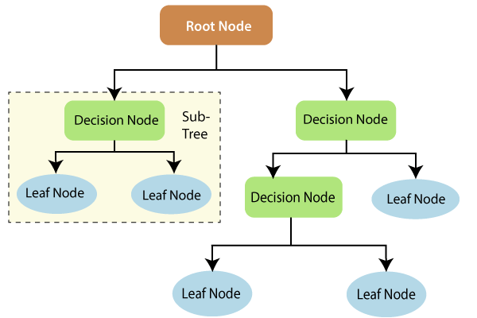

Image source: https://www.tutorialandexample.com/wp-content/uploads/2019/10/Decision-Trees-Root-Node.png


## Decision tree

```{r, warning=FALSE, message=FALSE}
# Load rpart and rpart.plot
library(rpart)
library(rpart.plot)
# Create a decision tree model
tree <- rpart(Species~Sepal.Length + Sepal.Width, data=data, cp=.02)
# Visualize the decision tree with rpart.plot
rpart.plot(tree, box.palette="RdBu", shadow.col="gray", nn=TRUE)

```

## Root node split

```{r}
ggplot(data, aes(x=Sepal.Length, y=Sepal.Width, col=Species)) + geom_point() + scale_color_manual(values = c("#1b9e77", "#d95f02")) + coord_fixed() + geom_vline(xintercept = 5.5) 
```

##  Root node split, Decision node split - right

```{r}
ggplot(data, aes(x=Sepal.Length, y=Sepal.Width, col=Species)) + geom_point() + scale_color_manual(values = c("#1b9e77", "#d95f02")) + coord_fixed() + geom_vline(xintercept = 5.5) + geom_hline(yintercept = 3)
```

##  Root node split, Decision node splits

```{r}
ggplot(data, aes(x=Sepal.Length, y=Sepal.Width, col=Species)) + geom_point() + scale_color_manual(values = c("#1b9e77", "#d95f02")) + coord_fixed() + geom_vline(xintercept = 5.5) + geom_hline(yintercept = 3) + geom_hline(yintercept = 3.3)
```

## Shallow decision tree

```{r}
# Create a decision tree model
tree <- rpart(Species~Sepal.Length + Sepal.Width, data=data, cp=.5)
# Visualize the decision tree with rpart.plot
rpart.plot(tree, box.palette="RdBu", shadow.col="gray", nn=TRUE)
```

## Two key ideas underlying trees

- Recursive partitioning (for constructing the tree)

- Pruning (for cutting the tree back)

- Pruning is a useful strategy for avoiding over fitting.  

- There are some alternative methods to avoid over fitting as well.

## Constructing Classification Trees

**Recursive Partitioning**

- Recursive partitioning splits P-dimensional feature space into nonoverlapping multidimensional rectangles.

- The division is accomplished recursively (i.e. operating on the results of prior division)

## Main questions

- Splitting variable
    
    Which attribute/ feature should be placed at the root node?
      
    Which features will act as internal nodes?
    
- Splitting point

- Looking for a split that increases the homogeneity (or "pure" as possible) of the resulting subsets.

## Example

split that increases the homogeneity 
 
```{r}
ggplot(data, aes(x=Sepal.Length, y=Sepal.Width, col=Species)) + geom_point() + scale_color_manual(values = c("#1b9e77", "#d95f02")) + coord_fixed() 
```

## Example (cont.)

split that increases the homogeneity .
 
```{r}
ggplot(data, aes(x=Sepal.Length, y=Sepal.Width, col=Species)) + geom_point() + scale_color_manual(values = c("#1b9e77", "#d95f02")) + coord_fixed() + geom_vline(xintercept = 5.5) 
```

## Key idea

1. Iteratively split variables into groups

2. Evaluate "homogeneity" within each group

3. Split again if necessary

## How does a decision tree determine the best split?

Decision tree uses entropy and information gain to select a feature which gives the best split.

## Measures of Impurity

- An impurity measure is a heuristic for selection of the splitting criterion that best separates a given feature space.

- The two most popular measures

    - Gini index
    
    - Entropy measure
    
## Gini index

Gini index for rectangle $A$ is defined by

$$I(A) = 1- \sum_{k=1}^mp_k^2$$

$p_k$ - proportion of records in rectangle $A$ that belong to class $k$

- Gini index takes value 0 when all the records belong to the same class.


## Gini index (cont)

In the two-class case Gini index is at peak when $p_k = 0.5$


## Entropy measure

$$entropy(A) = - \sum_{k=1}^{m}p_k log_2(p_k)$$

## Example: Calculation (left)


```{r, out.height="70%"}
df <- data.frame(x=rep(c(2, 4, 6, 8), each=4),
                 y=rep(c(2, 4, 6, 8), times=4), col=factor(c(rep("red", 15), "blue")))
ggplot(df, aes(x=x, y=y, col=col)) + geom_point(size=4)
```

## Example: calculation (right) (cont.) 

```{r, out.height="70%"}
df <- data.frame(x=rep(c(2, 4, 6, 8), each=4),
                 y=rep(c(2, 4, 6, 8), times=4), col=factor(c(rep("red", 8), rep("blue", 8))))
ggplot(df, aes(x=x, y=y, col=col)) + geom_point(size=4)
```

## Finding the best threshold split?

In-class demonstration


## Overfitting in decision trees

- Overfitting refers to the condition when the model completely fits the training data but fails to generalize the testing unseen data.

- If a decision tree is fully grown or when you increase the depth of the decision tree, it may lose some generalization capability.

- Pruning is a technique that is used to reduce overfitting. Pruning simplifies a decision tree by removing the weakest rules.


## Stopping criteria

- Tree depth (number of splits)

- Minimum number of records in a terminal node

- Minimum reduction in impurity

- Complexity parameter ($CP$ ) - available in `rpart` package

## Pre-pruning (early stopping)

- Stop the learning algorithm **before** the tree becomes too complex

- **Hyperparameters** of the decision tree algorithm that can be tuned to get a robust model

`max_depth`

`min_samples_leaf`

`min_samples_split`

## Post pruning

Simplify the tree **after** the learning algorithm terminates

The idea here is to allow the decision tree to grow fully and observe the CP value

## Simplify the tree after the learning algorithm terminates

- Complexity of tree is measured by number of leaves. 

$L(T) = \text{number of leaf nodes}$

- The more leaf nodes you have, the more complexity.

- We need a balance between complexity and predictive power

Total cost = measure of fit + measure of complexity

## Total cost = measure of fit + measure of complexity

measure of fit: error

measure of complexity: number of leaf nodes ($L(T)$)

$\text{Total cost } (C(T)) = Error(T) + \lambda L(T)$


The parameter $\lambda$ trade off between complexity and predictive power. The parameter $\lambda$ is a penalty factor for tree size.

$\lambda = 0$: Fully grown decision tree

$\lambda = \infty$: Root node only

$\lambda$ between 0 and $\infty$ balance predictive power and complexity.

## Example: candidate for pruning (in-class)


```{r warning=FALSE, message=FALSE}
# Load rpart and rpart.plot
library(rpart)
library(rpart.plot)
# Create a decision tree model
tree <- rpart(Species~Sepal.Length + Sepal.Width, data=data, cp=.02)
# Visualize the decision tree with rpart.plot
rpart.plot(tree, box.palette="RdBu", shadow.col="gray", nn=TRUE)

```

## Classification trees - label of terminal node

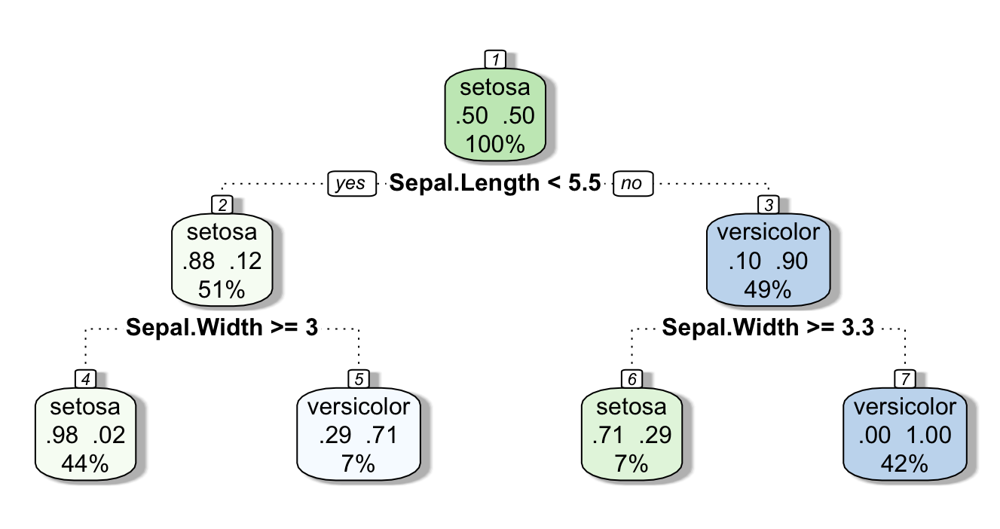

labels are based on majority votes.

## Regression Trees

```{r, warning=FALSE, message=FALSE}
# Load rpart and rpart.plot
library(rpart)
library(rpart.plot)
# Create a decision tree model
tree <- rpart(Petal.Length~Sepal.Length + Sepal.Width, data=data, cp=.02)
# Visualize the decision tree with rpart.plot
rpart.plot(tree, box.palette="RdBu", shadow.col="gray", nn=TRUE)

```

## Regression Trees

Value of the terminal node: average outcome value of the training records that were in that terminal node.

**Your turn: ** Impurity measures for regression tree

## Decision trees - advantages

- Easy to interpret

- Better performance in non-linear setting

-  No feature scaling required

## Decision trees - disadvantages

- Unstable: Adding a new data point or little bit of noise can lead to re-generation of the overall tree and all nodes need to be recalculated and recreated.

- Not suitable for large datasets

## Decision Tree

```{r}
data <- iris[1:100,]
library(rpart)
library(rpart.plot)
# Create a decision tree model
tree <- rpart(Species~Sepal.Length + Sepal.Width, data=data, cp=.02)
# Visualize the decision tree with rpart.plot
rpart.plot(tree, box.palette="RdBu", shadow.col="gray", nn=TRUE)

```

## Decision boundary

```{r,  message=FALSE, warning=FALSE}
library(tidyverse)
ggplot(data, aes(x=Sepal.Length, y=Sepal.Width, col=Species)) + geom_point() + scale_color_manual(values = c("#1b9e77", "#d95f02")) + coord_fixed() + geom_vline(xintercept = 5.5) + geom_hline(yintercept = 3) + geom_hline(yintercept = 3.3)
```

## Decision trees - Limitation

To capture a complex decision boundary we need to use a deep tree

In-class explanation

## Bias-Variance Tradeoff

- A deep decision tree has low bias and high variance. 

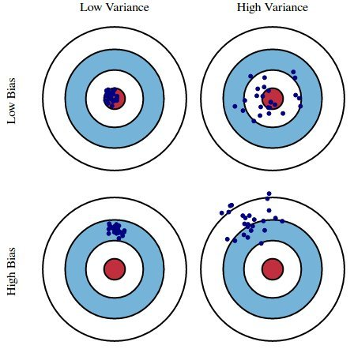

## Bagging (Bootstrap Aggregation)

- Technique for reducing the variance of an estimated predicted function

- Works well for high-variance, low-bias procedures, such as trees

## Ensemble Methods

- Combines several base models


- **Bagg**ing (**B**ootstrap **Agg**regation) is an ensemble method

<!--The main idea is that each individual learner is weak and therefore less likely to pick up on every single pattern so the more learners you have the better.-->

## Ensemble Methods

"Ensemble learning gives credence to the idea of the “wisdom of crowds,” which suggests that the decision-making of a larger group of people is typically better than that of an individual expert."

Source: https://www.ibm.com/cloud/learn/boosting

## Bootstrap

- Generate multiple samples of training
data, via bootstrapping

Example

Training data: $\{(y_1, x_1), (y_2, x_2), (y_3, x_3), (y_4, x_4)\}$

Three samples generated from bootstrapping

Sample 1 = $\{(y_1, x_1), (y_2, x_2), (y_3, x_3), (y_4, x_4)\}$

Sample 2 = $\{(y_1, x_1), (y_1, x_1), (y_1, x_1), (y_4, x_4)\}$

Sample 3 = $\{(y_1, x_1), (y_2, x_2), (y_1, x_1), (y_4, x_4)\}$

## Aggregation


- Train a decision tree on each bootstrap sample of data without pruning.

- Aggregate prediction using either voting or averaging

## Bagging - in class diagram


## Bagging

**Pros**

- Ease of implementation

- Reduction of variance


**Cons**

- Loss of interpretability

- Computationally expensive

## Bagging

- Bootstrapped subsamples are created

- A Decision Tree is formed on each bootstrapped sample.

- The results of each tree are aggregated


## Random Forests: Improving on Bagging

- The ensembles of trees in Bagging tend to be
highly correlated.

- All of the bagged trees will look quite similar to each other. Hence, the predictions from the bagged trees will be highly correlated.


## Random Forests

1. Bootstrap samples

2. At each split, randomly select a set
of predictors from the full set of predictors

3. From the selected predictors we select the
optimal predictor and the optimal corresponding
threshold for the split.

4. Grow multiple trees and aggregate

## Random Forests - Hyper parameters

1. 	
Number of variables randomly sampled as candidates at each split

2. 	Number of trees to grow

3. Minimum size of terminal nodes. Setting this number larger causes smaller trees to be grown (and thus take less time).

Note: In theory, each tree in the random forest is full (not pruned), but in
practice this can be computationally expensive,thus, imposing a minimum node size is not unusual.

## Random Forests

- Bagging ensemble method

- Gives final prediction by aggregating the predictions of bootstrapped decision tree samples. 

- Trees in a random forest are independent of each other.

## Random Forests

**Pros**

- Accuracy

**Cons**

- Speed

- Interpretability

- Overfitting

## Out-of-bag error

With ensemble methods, we get a new metric for assessing the
predictive performance of the model, the out-of-bag error

## Random Forests

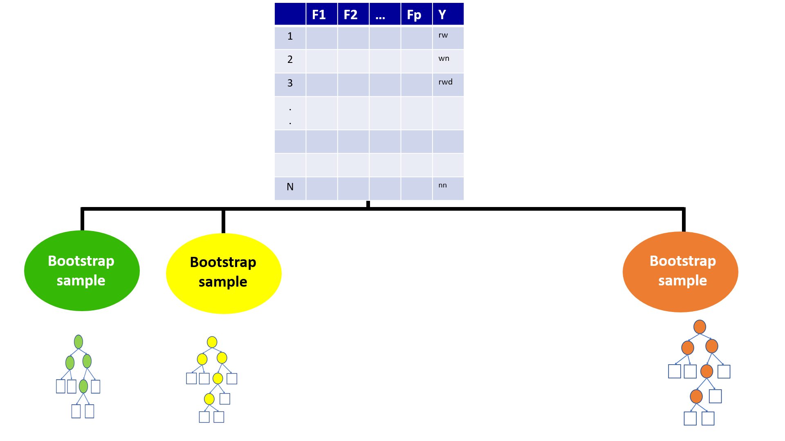


## Random Forests


## Out-of-Bag (OOB) Samples

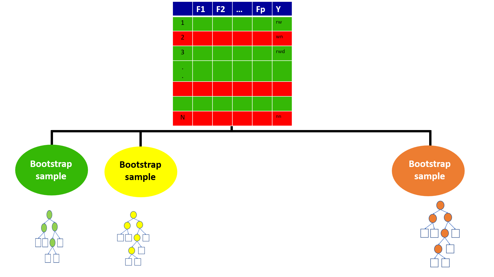


## Out-of-Bag (OOB) Samples

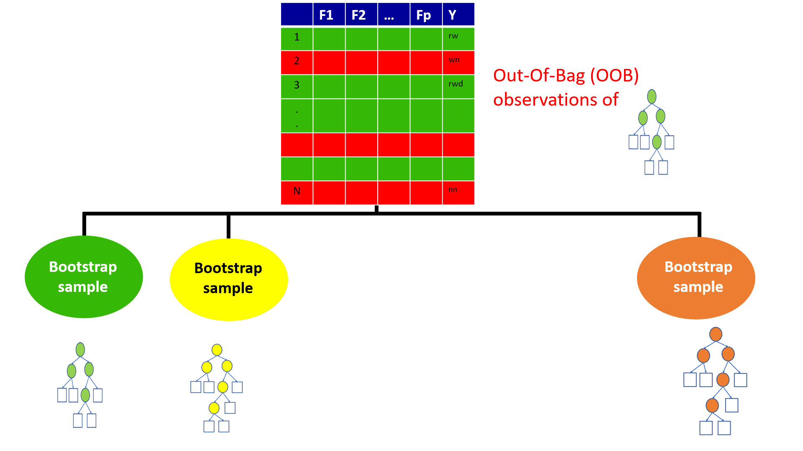


## Predictions based on OOB observations

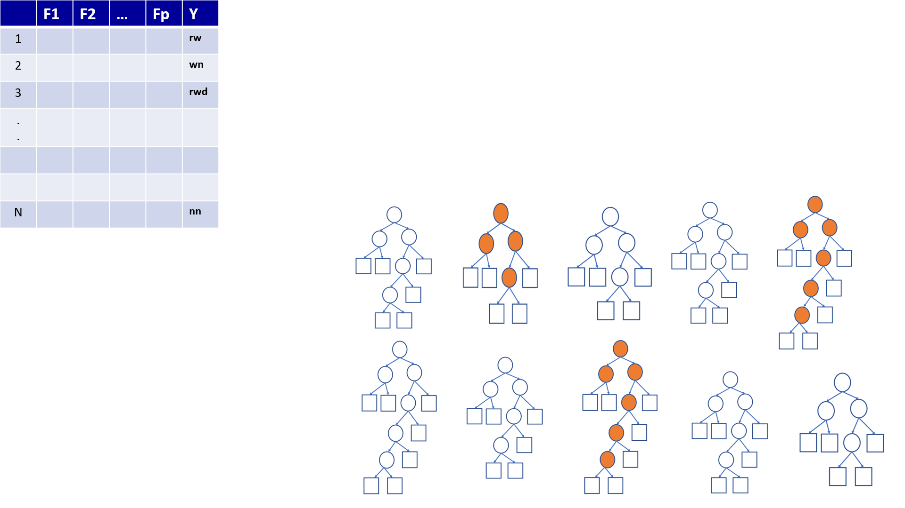

## Predictions based on OOB observations


## Predictions based on OOB observations

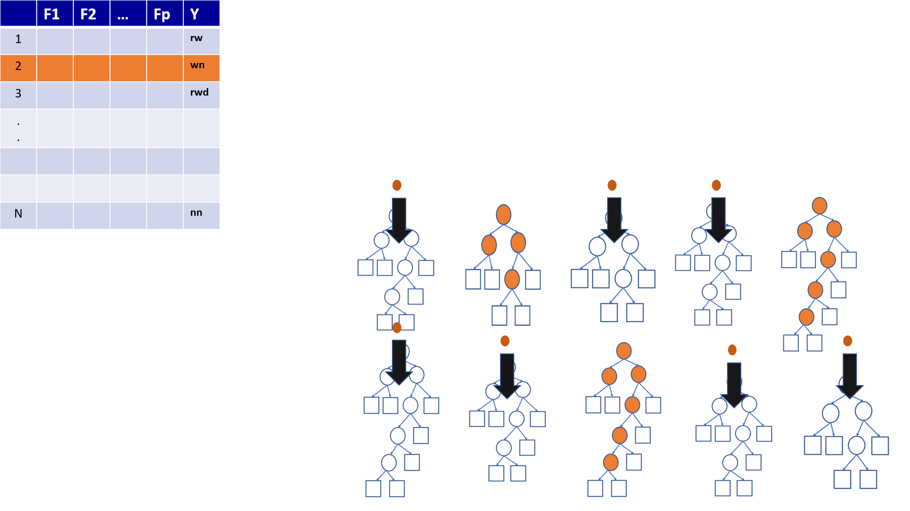


## Predictions based on OOB observations


## Predictions based on OOB observations


## Predictions based on OOB observations


## Predictions based on OOB observations

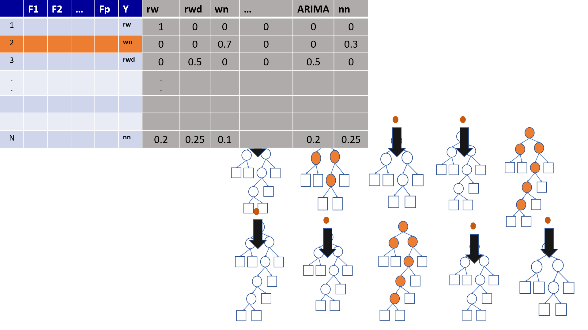

## Predictions based on OOB observations

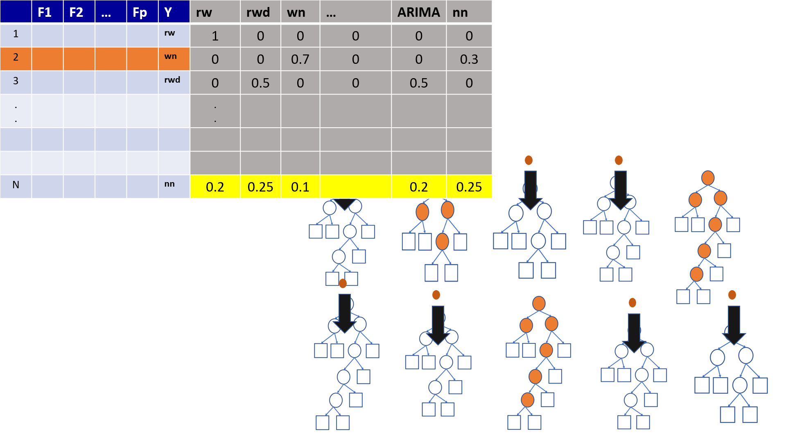

## Predictions based on OOB observations

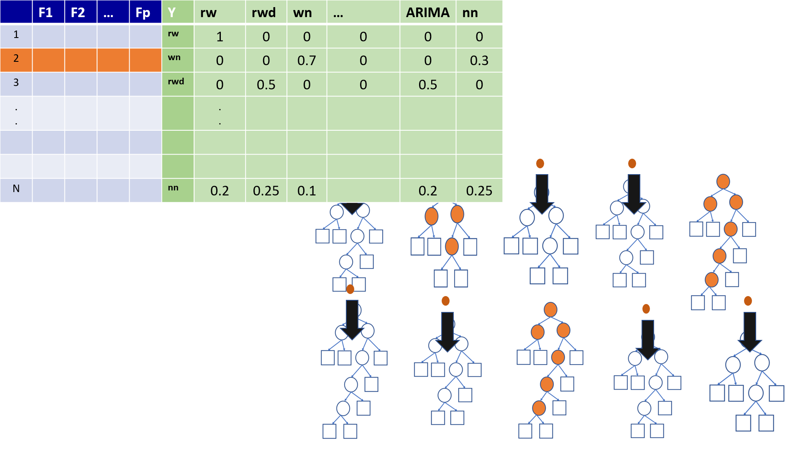

## Variable Importance in Random Forest

**contribution to predictive accuracy**

- Permutation-based variable importance

- Mean decrease in Gini coefficient

## Permutation-based variable importance

-  the OOB samples are passed down the tree, and the prediction accuracy is recorded

- the values for the $j^{th}$ variable are randomly permuted in the OOB samples, and the accuracy is again computed.

- the decrease in accuracy as a result of this permuting is averaged over all trees, and is used as a measure of the importance of variable $j$ in the random forests

## Mean decrease in Gini coefficient

- Measure of how each variable contributes to the homogeneity of the nodes and leaves in the resulting random forest

- The higher the value of mean decrease accuracy or mean decrease Gini score, the higher the importance of the variable in the model

# Practical Session


## Packages

```{r}
library(tidymodels)
library(tidyverse)
library(palmerpenguins)
library(rpart)
library(skimr)
library(rpart.plot)
```

## Data

```{r}
data(penguins)
skim(penguins)
```

## Split data

```{r}
set.seed(123)
penguin_split <- initial_split(penguins)
penguin_train <- training(penguin_split)
dim(penguin_train)
head(penguin_train)
penguin_test <- testing(penguin_split)
dim(penguin_test)
```

## Build decision tree

```{r}
tree1 <- rpart(species ~ ., penguin_train,  cp = 0.1)
rpart.plot(tree1, box.palette="RdBu", shadow.col="gray", nn=TRUE)
tree2 <- rpart(species ~ ., penguin_train,  cp = 0.5)
rpart.plot(tree2, box.palette="RdBu", shadow.col="gray", nn=TRUE)
```


## Predict

```{r}
predict(tree1, penguin_test)
t_pred <- predict(tree1, penguin_test, type = "class")
t_pred
```

## Accuracy

```{r}
confMat <- table(penguin_test$species,t_pred)
confMat
```

# Random forest

```{r}
# packages
library(tidyverse)
library(randomForest)
```


```{r}
# Split data
data(iris)
df <- iris %>% mutate(id = row_number())
## set the seed to make your partition reproducible
set.seed(123)
train <- df %>% sample_frac(.80)
dim(train)
test <- anti_join(df, train, by = 'id')
dim(test)
```


```{r}
# Model building
?randomForest
rf1 <- randomForest(Species ~  Sepal.Length+
                      Sepal.Width+  Petal.Length + 
                      Petal.Width,
                    data=train)
rf1

rf2 <- randomForest(Species ~  Sepal.Length+
                      Sepal.Width+  Petal.Length + 
                      Petal.Width,
                    data=train, ntree=1000)
rf2

rf3 <- randomForest(Species ~  Sepal.Length+
                      Sepal.Width+  Petal.Length + 
                      Petal.Width,
                    data=train, ntree=1000,
                    mtry=3)
rf3
```


## Obtain predictions for the test set

```{r}
pred <- predict(rf2, test)
pred
table(pred, test$Species)


## variable importance
varImpPlot(rf2, sort=T, main="Variable Importance")

## variable importance table

var.imp <- data.frame(importance(rf2, type=2))
var.imp
```

