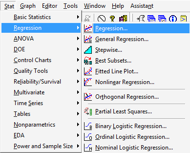
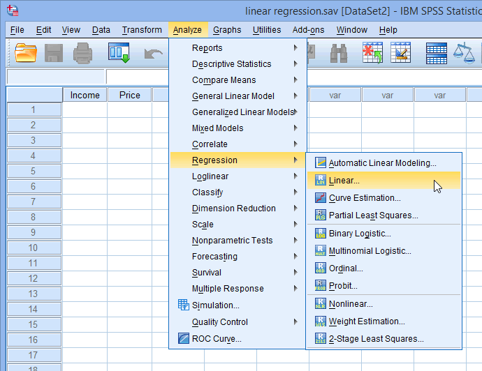
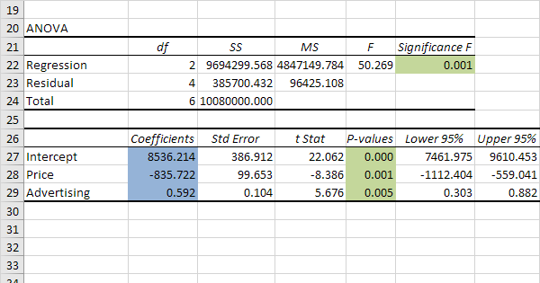

```{r setup, include=FALSE}
knitr::opts_chunk$set(echo = TRUE)
```

## Regression with Minitab



## Regression with SPSS



## Regression with Excel



## Regression with Phython


```r
import pandas as pd
import numpy as np
import matplotlib.pyplot as plt
%matplotlib inline

```


```r
from sklearn.linear_model import LinearRegression
regressor = LinearRegression()
regressor.fit(X_train, y_train)
```
