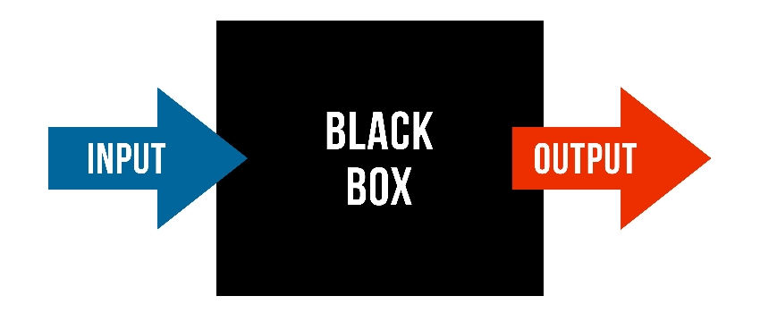
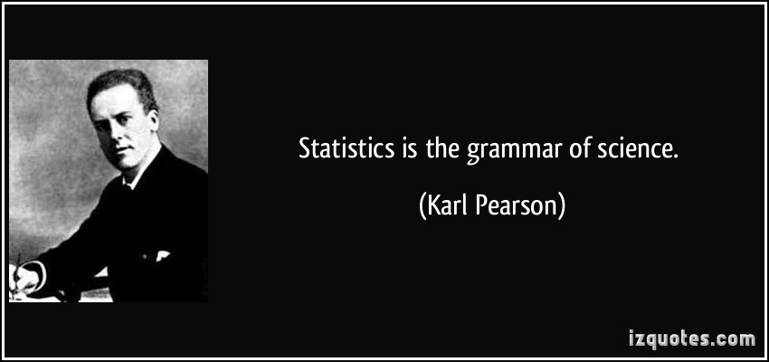

```{r setup, include=FALSE}
options(htmltools.dir.version = FALSE)
```


### What is Regression Analysis?

- Statistical technique for investigating and modeling the relationship between variables.

### Statistical Modeling

- a simplified, mathematically-formalized way to approximate reality (i.e. what generates your data) and optionally to make predictions from this approximation.


---

background-image: url('regression.PNG')
background-position: center
background-size: contain


### Statistical Modelling: The Bigger Picture

---
background-image: url('workflowds.png')
background-position: center
background-size: contain


### Statistical Modelling Workflow

<!--https://github.com/MaximeWack/tidyflow-->

.footer-note[.tiny[.green[Image Credit: ][Hadley Wickham ](https://r4ds.had.co.nz/)]]
---
background-image: url('hellor.png')
background-position: center
background-size: contain

### Software: R and RStudio (IDE) [Visit: https://hellor.netlify.app/]
---
### Consider trying to answer the following kinds of questions:

- To use the parents’ heights to predict childrens’ heights.

.pull-left[
```{r, comment=NA, message=FALSE, warning=FALSE, echo=FALSE}
library(alr4)
head(Heights)
```
]

.pull-right[
```{r, comment=NA, message=FALSE, warning=FALSE, echo=FALSE}
library(tidyverse)
library(magrittr)
ggplot(Heights, aes(y=dheight, x=mheight)) + geom_point(alpha=0.5) + coord_equal()

```

]

Predict the daughter's height if her mother's height is 66 inches?


---
background-image: url('calculator.png')
background-position: right
background-size: contain

---

background-image: url('curvefitting.jpg')
background-position: right
background-size: contain


.pull-left[

- Regression Analysis involves curve fitting.

- **Curve fitting:** The process of finding a relation or equation of **best fit**.

]


---

# Model

<!--https://www2.stat.duke.edu/courses/Spring19/sta210.001/slides/lec-slides/01-regression-intro.html#18-->

$$Y = f(x_1, x_2, x_3) + \epsilon$$

> Goal: Estimate $f$ ?

## How do we estimate $f$?

### Non-parametric methods:

estimate $f$ using observed data without making explicit assumptions about the functional form of $f$.

### Parametric methods

estimate $f$ using observed data by making assumptions about the functional form of $f$.

Ex: $Y = \beta_0 + \beta_1x_1 + \beta_2x_2 + \beta_3x_3 + \epsilon$

---
background-image: url('regressionpaper1.png')
background-position: center
background-size: contain

---
background-image: url('regressionpaper2.png')
background-position: center
background-size: contain

     
---
background-image: url('regressionpaper3.png')
background-position: center
background-size: contain


---

## Do not under-estimate the power of simple models.

<iframe width="560" height="315" src="https://www.youtube.com/embed/1zX6diCwlZA" frameborder="0" allow="accelerometer; autoplay; encrypted-media; gyroscope; picture-in-picture" allowfullscreen></iframe>

<!--https://www.linkedin.com/feed/update/urn:li:activity:6489030516644380672/-->

--


- Create something new which is more efficient than the existing method.


---
background-image: url('GDPR.jpg')
background-position: center
background-size: contain

---

## Machine Learning Algorithms


.pull-left[


]

.pull-right[


]

--

- Random Forest

- XGboost

- Neural networks, etc.


---
## Pearson Correlation Coefficient



- Measures the strength of the linear relationship between two quantitative variables. 

- Does not completely characterize their relationship.

---

## Pearson Correlation Coefficient


---
class: center, middle

All rights reserved by 

[Dr. Thiyanga S. Talagala](https://thiyanga.netlify.app/) 


