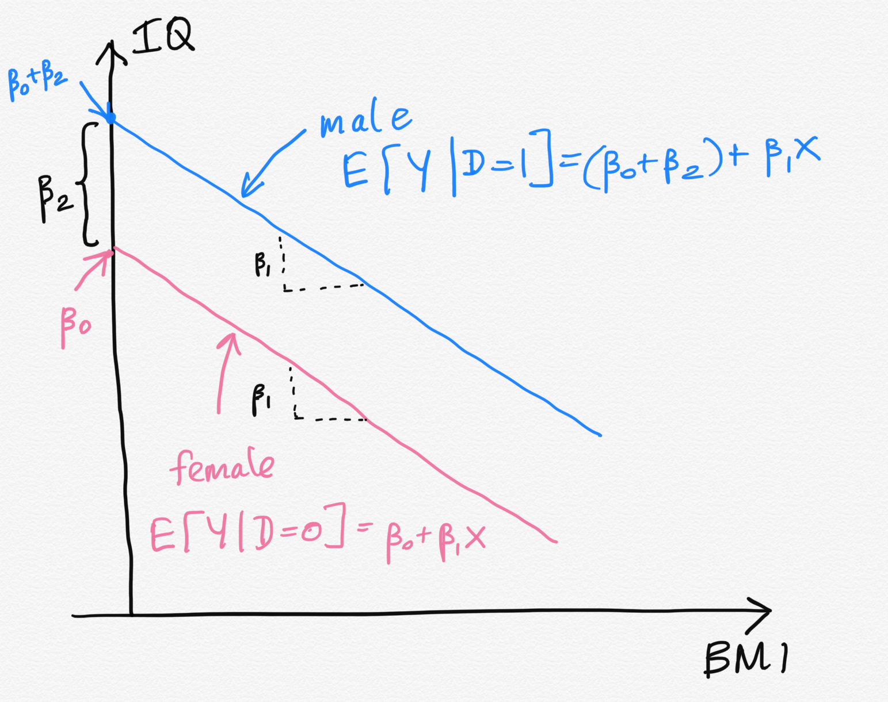

```{r setup, include=FALSE}
options(htmltools.dir.version = FALSE)
```

## Introduction

- All the independent variables we have considered up to this point have been measured on a continuous scale. 

- Regression analysis can be generalized to incorporate qualitative variables. 

- Examples of qualitative variables:

    - Gender (male, female)
    - Smoking status (smoker, nonsmoker)
    - Employment status (full-time, part-time, unemployed)
    - BMI (underweight, normal, overweight, obese)

- Categorical variables can be incorporated into regression through **indicator variables**.

- Sometimes indicator variables are called **dummy variable.**


---

## Creating dummy variables

```{r, comment=NA, message=FALSE, echo=FALSE}
data <- data.frame(IQ=c(10, 20, 100, 98, 100, 11, 50, 70), Gender = c("Male", "Male", "Male", "Male", "Female", "Female", 
  "Female", "Female"), BMI = c(20.2, 20.5, 18.5, 25, 24.9, 31, 18.5, 20))
data

```


Indicator variable for `Gender`

$$D_i = \left\{
    \begin{array}\\
        1 & \mbox{if male} \\
        0 & \mbox{if female} 
    \end{array}
\right.$$

The choice of 0 and 1 to identify the levels of a qualitative variable is arbitrary.

---

## Regression equation

.pull-left[
```{r, comment=NA, message=FALSE, echo=FALSE}
data <- data.frame(IQ=c(10, 20, 100, 98, 100, 11, 50, 70), Gender = c("Male", "Male", "Male", "Male", "Female", "Female", 
  "Female", "Female"), BMI = c(20.2, 20.5, 18.5, 25, 24.9, 31, 18.5, 20),
  D=c(1, 1, 1, 1, 0, 0, 0, 0))
data

```
]

.pull-right[

Indicator variable for `Gender`

$$D_i = \left\{
    \begin{array}\\
        1 & \mbox{if male} \\
        0 & \mbox{if female} 
    \end{array}
\right.$$

]

Regression equation

$$y_i = \beta_0 + \beta_1 x_i + \beta_2D_i + \epsilon_i,$$
where $x$ represents the variable `BMI`.

---

## Regression equation (cont.)

$$y_i = \beta_0 + \beta_1 x_i + \beta_2D_i + \epsilon_i,$$

where $x$ represents the variable `BMI`.

### Regression equation for **males**, $D_i = 1$

$$y_i = \beta_0 + \beta_1 x_i + \beta_2 + \epsilon_i,$$

$$y_i = (\beta_0 +  \beta_2) + \beta_1 x_i + \epsilon_i,$$

- Thus the relationship between **IQ score** and **BMI** for **males** is a straight line with intercept $\beta_0+\beta_2$ and slope $\beta_1$.


### Regression equation for **females**, $D_i = 0$

$$y_i = \beta_0 + \beta_1 x_i + \epsilon_i,$$

- Thus the relationship between **IQ score** and **BMI** for **females** is a straight line with intercept $\beta_0$ and slope $\beta_1$.


---
## Regression equation (cont.)

.pull-left[
Regression equation for **males**, $D_i = 1$

$$y_i = (\beta_0 +  \beta_2) + \beta_1 x_i + \epsilon_i,$$

Regression equation for **females**, $D_i = 0$

$$y_i = \beta_0 + \beta_1 x_i + \epsilon_i,$$
]

.pull-right[

]
---

.pull-left[


]

.pull-right[

- Two parallel lines (a common slope and different intercepts).

- $\beta_2$ expresses differences in heights between the two regression lines.

### Interpretations


- $\beta_1$ - Change in the mean response, $\mu_Y$, for each additional unit increase in the BMI when other variables held at constant.

- $\beta_2$ is a measure of how much higher (or lower) the mean response of the male group is than that of the female group.

( $\beta_2$ is a measure of the difference in mean IQ score resulting from changing from male group to female group)
]


---
## Qualitative variable with more than 2 levels

In general, a qualitative variable with $k$ levels is represented by $k-1$ indicator variables, each taking the values 0 and 1.

.pull-left[
```{r, comment=NA, message=FALSE, echo=FALSE}
data <- data.frame(IQ=c(10, 20, 100, 98, 100, 11, 50, 70), BMI = c("Normal", "Normal", "Obese", "Obese", "Underweight", "Underweight", 
  "Underweight", "Underweight"), headcir = c(50.2, 50.5, 58.5, 55, 54.9, 40, 48.5, 50),
D1 =c(0, 0, 0, 0, 1, 1, 1, 1),
D2 = c(1, 1, 0, 0, 0, 0, 0, 0))
data

```
]

.pull-right[

$D_1$ | $D_2$ | Description |
---|---|---| ---|
1|0|observation is from underweight |
0|1|observation is from normal |
0|0|observation is from Obese |
]

.pull-left[
$$D_{1i} = \left\{
    \begin{array}\\
        1 & \mbox{if underweight} \\
        0 & \mbox{if otherwise} 
    \end{array}
\right.$$

$$D_{2i} = \left\{
    \begin{array}\\
        1 & \mbox{if normal} \\
        0 & \mbox{if otherwise} 
    \end{array}
\right.$$

]

---
## Your turn

Write the regression equations for the three levels.

```{r, comment=NA, message=FALSE, echo=FALSE}
data <- data.frame(IQ=c(10, 20, 100, 98, 100, 11, 50, 70), headcir = c(50.2, 50.5, 58.5, 55, 54.9, 40, 48.5, 50),
D1 =c(0, 0, 0, 0, 1, 1, 1, 1),
D2 = c(1, 1, 0, 0, 0, 0, 0, 0))
data

```

---

class: center, middle


Acknowledgement

Introduction to Linear Regression Analysis, Douglas C. Montgomery, Elizabeth A. Peck, G. Geoffrey Vining


All rights reserved by 

[Dr. Thiyanga S. Talagala](https://thiyanga.netlify.app/) 


