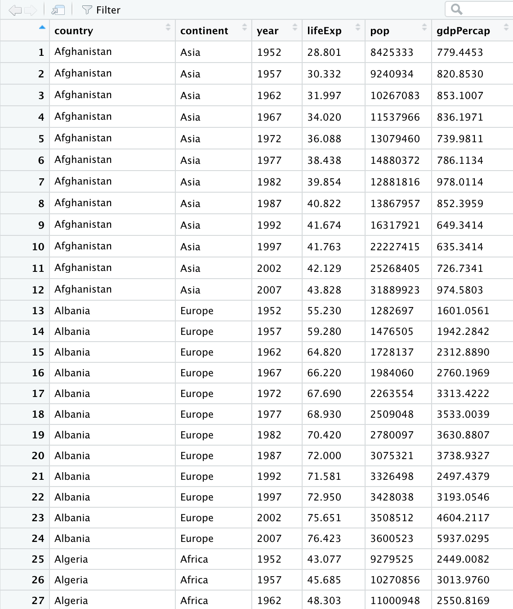
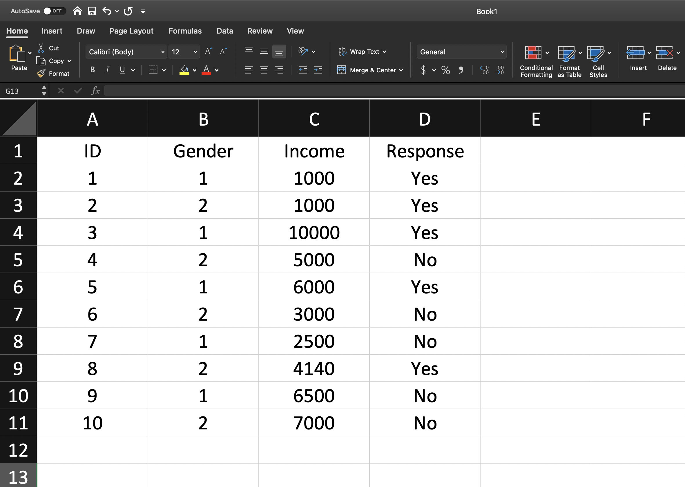

```{r setup, include=FALSE}
options(htmltools.dir.version = FALSE)
```

background-image: url('orange.jpg')
background-position: center
background-size: cover

# What is Data Analysis?
.footer-note[.tiny[.green[Image Credit: Pixabay ]]]
--
.content-box-yellow[
It is all about extracting information out of data in order to make better decisions.]


---
# What is Data Analysis?


It is all about extracting information out of data in order to make better decisions.
--
.pull-left[


]

.pull-right[
```{r, cache=TRUE, comment=NA, message=FALSE, warning=FALSE, echo=FALSE}
library(ggplot2)
library(gganimate)
library(gapminder)
p <- ggplot(
  gapminder, 
  aes(x = gdpPercap, y=lifeExp, size = pop, colour = country)
  ) +
  geom_point(show.legend = FALSE, alpha = 0.7) +
  scale_color_viridis_d() +
  scale_size(range = c(2, 12)) +
  scale_x_log10() +
  labs(x = "GDP per capita", y = "Life expectancy")
p + facet_wrap(~continent) +
  transition_time(year) +
  labs(title = "Year: {frame_time}")

```

]

---

# Data Analysis Workflow


---
# Outline

1. Basics of R Programming

2. Data Import

3. Data Wrangling

4. Data Visualization

---

# Outline

1. Basics of R Programming 

2. Data Import

3. Data Wrangling

4. Data Visualization

---

# What is R? 

- R is a software environment for statistical computing and graphics.

- Language designers: **R**oss Ihaka and **R**obert Gentleman at the University of Auckland, New Zealand.

- Parent language: S

- The latest R version 4.0.0 has been released on 2020-04-24.


---

# Why R?

- **Free**

- **Powerful:** Over 14600 contributed packages on the main repository (CRAN), as of July 2019, provided by top international researchers and programmers

- **Flexible:** It is a language, and thus allows you to create your own solutions

- **Community:** Large global community friendly and helpful, lots of resources

---

background-image: url('renv.png')
background-position: center
background-size: contain

## R environment
---

background-image: url('rstudio1.png')
background-position: center
background-size: contain

## The RStudio IDE
---

background-image: url('rstudio2.png')
background-position: center
background-size: contain

## The RStudio IDE

.footer-note[.tiny[.green[Image Credit: ][Clastic Detritus ](https://clasticdetritus.com/2013/01/10/creating-data-plots-with-r/)]]
---

background-image: url('airport.jpg')
background-position: center
background-size: cover

.content-box-yellow[
## R and RStudio
]

.footer-note[.tiny[.green[Image Credit: ][Clastic Detritus ](https://clasticdetritus.com/2013/01/10/creating-data-plots-with-r/)]]
---


background-image: url('airport.jpg')
background-position: center
background-size: cover

.content-box-yellow[
## R and RStudio

"If R were **an airplane**, RStudio would be **the airport**, providing many, many supporting services that make it easier for you, the pilot, to take off and go to awesome places. Sure, you can fly an airplane without an airport, but having those runways and supporting infrastructure is a game-changer." 

-- Julie Lowndes]

.footer-note[.tiny[.green[Image Credit: ][Clastic Detritus ](https://clasticdetritus.com/2013/01/10/creating-data-plots-with-r/)]]
---

class: inverse, center, middle

# Create a new project

---
background-image: url('project1.png')
background-position: center
background-size: contain
---

background-image: url('project2.png')
background-position: center
background-size: contain
---

background-image: url('project3.png')
background-position: center
background-size: contain
---

background-image: url('project4.png')
background-position: center
background-size: contain
---

background-image: url('project5.png')
background-position: center
background-size: contain
---
background-image: url('project6.png')
background-position: center
background-size: contain
---

## R Console

```{r, comment=NA}
7+1

```


```{r, comment=NA}
rnorm(10) 

```

--

## Variable assignment

```{r, comment=NA}
a <- rnorm(10)
a
```

--

```{r, comment=NA}
b <- a*100
b
```

---


# Data permanency

- `ls()` can be used to display the names of the objects which are currently stored within R.

- The collection of objects currently stored is called the **workspace**.

```{r, comment=NA}
ls()

```

--
- To remove objects the function `rm` is available

    - remove all objects `rm(list=ls())`
    
    - remove specific objects `rm(x, y, z)`
    
    
```{r, comment=NA}
rm(a)
ls()
```

```{r, comment=NA}
rm(list=ls())
ls()
```

---

background-image: url('project7.png')
background-position: center
background-size: cover

--
.pull-left[.full-width[.content-box-yellow[At the end of an R session, if **save**: the objects are written to a file called .RData in the current directory, and the command lines used in the session are saved to a file called .Rhistory]]]

---

background-image: url('p81.png')
background-position: center
background-size: cover

.pull-left[.full-width[.content-box-yellow[When R is started at later time **from the same directory** ]]]

---
background-image: url('p82.png')
background-position: center
background-size: cover

.pull-left[.full-width[.content-box-yellow[When R is started at later time **from the same directory** it reloads the **associated workspace** and **commands history.**]]]

---

background-image: url('project9.png')
background-position: center
background-size: cover

--
.pull-left[.full-width[.content-box-yellow[When R is started at later time **from the same directory** it reloads the **associated workspace** and **commands history.**]]]

---

## Comment your code

- Each line of a comment should begin with the comment symbol and a single space: # . 

```{r, comment=NA}
rnorm(10) # This is a comment 
sum(1:10) # 1+2
```

---

## Style Guide

- Good coding style is like correct punctuation: you can manage without it, butitsuremakesthingseasiertoread.  -- Hadley Wickham

```{r, comment=NA}
sum(1:10)#Bad commenting style
sum(1:10) # Good commenting style

```

- Also, use commented lines of - and = to break up your file into easily readable sub-sections.

```r
# Read data ----------------

# Plot data ----------------
```

To learn more read Hadley Wickham's [Style guide](http://adv-r.had.co.nz/Style.html).

---

## Objects in R

- R is an [object-oriented language](https://en.wikipedia.org/wiki/Object-oriented_programming).

--
- An object in R is anything (data structures, functions, etc., that can be assigned to a variable).

--

Let's take a look of some common types of objects.

--

1. .red[Data structures] are the ways of arranging data.

    - You can create objects, using the left pointing arrow <-
--
1. .red[Functions] tell R to do something.

    - A function may be applied to an object.

    - Result of applying a function is usually an object too.

    - All function calls need to be followed by parentheses.

```{r, comment=NA}
a <- 1:20 # data structure
sum(a) # sum is a function applied on a

```

```r
help.start() # Some functions work on their own.
```
---

# Getting help with functions and features

- R has inbuilt help facility


### Method 1

```r
help(rnorm)
```

- For a feature specified by special characters such as `for`, `if`, `[[`

```r
help("[[")
```

- Search the help files for a word or phrase.

```r
help.search(‘weighted mean’) 
```

### Method 2

```r
?rnorm
```

```r
??rnorm
```

---
background-image: url('dataStructures.png')
background-position: center
background-size: contain

## Data structures

.footer-note[.tiny[.green[Image Credit: ][venus.ifca.unican.es](http://venus.ifca.unican.es/Rintro/dataStruct.html)]]


---

background-image: url('dataStructures.png')
background-position: center
background-size: contain

## Data structures

.content-box-yellow[Data structures differ in terms of,

- Type of data they can hold

- How they are created

- Structural complexity

- Notation to identify and access individual elements
]

.footer-note[.tiny[.green[Image Credit: ][venus.ifca.unican.es](http://venus.ifca.unican.es/Rintro/dataStruct.html)]]

---

background-image: url('horse.png')
background-position: center
background-size: cover


---
class: duke-green, center, middle

# 1. Vectors

---

# Vectors

- Vectors are one-dimensional arrays that can hold numeric data, character data, or logical data.

- Combine function c() is used to form the vector.

- Data in a vector must only be one type or mode (numeric, character, or logical). You can’t mix modes in the same vector.


## Vector assignment

**Syntax**

```r
vector_name <- c(element1, element2, element3)

```

```r
x <- c(5, 6, 3, 1 , 100)
```

- assignment operator ('<-'), '=' can be used as an alternative.

- `c()` function

.red[What will be the output of the following code?]

```r
y <- c(x, 500, 600)
```

---

# Types and tests with vectors


```{r, eval=TRUE}
first_vec <- c(10, 20, 50, 70)
second_vec <- c("Jan", "Feb", "March", "April")
third_vec <- c(TRUE, FALSE, TRUE, TRUE)
fourth_vec <- c(10L, 20L, 50L, 70L)
```


To check if it is a 

- vector: `is.vector()`

```{r, comment=NA}
is.vector(first_vec)
```


- charactor vector: `is.charactor()`

```{r, comment=NA}
is.character(first_vec)
```
---
- double: `is.double()`

```{r, comment=NA}
is.double(first_vec)
```


- integer: `is.integer()`

```{r, comment=NA}
is.integer(first_vec)
```

- logical: `is.logical()`

```{r, comment=NA}
is.logical(first_vec)
```

- length

```{r, comment=NA}
length(first_vec)
```
---

# Coercion

Vectors must be homogeneous. When you attempt to combine different types they will be coerced to the most flexible type so that every element in the vector is of the same type.

Order from least to most flexible

`logical` --> `integer` --> `double` --> `character`

```{r, comment=NA}
a <- c(3.1, 2L, 3, 4, "GPA") 
typeof(a) 
```

```{r, comment=NA}
anew <- c(3.1, 2L, 3, 4)
typeof(anew) 
```

---

### Explicit coercion

Vectors can be explicitly coerced from one class to another using the `as.*` functions, if available. For example, `as.charactor`, `as.numeric`, `as.integer`, and `as.logical`.

```{r, comment=NA}
vec1 <- c(TRUE, FALSE, TRUE, TRUE)
typeof(vec1)

vec2 <- as.integer(vec1)
typeof(vec2)
vec2
```

.red[Why does the below output NAs?]

```{r, comment=NA}
x <- c("a", "b", "c")
as.numeric(x)
```

---


```{r, comment=NA}
x1 <- 1:3
x2 <- c(10, 20, 30)
combinedx1x2 <- c(x1, x2)
combinedx1x2 
```

--

```{r, comment=NA}
class(x1)
class(x2)
class(combinedx1x2)

```
--
- If you combine a numeric vector and a character vector 

```{r, comment=NA}
y1 <- c(1, 2, 3)
y2 <- c("a", "b", "c")
c(y1, y2)

```

---

### Simplifying vector creation

- colon `:` produce regular spaced ascending or descending sequences.

```{r, comment=NA}
 10:16

-0.5:8.5

```
--
- sequence: `seq(initial_value, final_value, increment)`

```{r, comment=NA}
seq(1,11)

seq(1, 11, length.out=5)

seq(0, 11, by=2)
```

---

- repeats `rep()` 

```{r, comment=NA}
rep(9, 5)

rep(1:4, 2)

rep(1:4, each=2) # each element is repeated twice

rep(1:4, times=2) # whole sequence is repeated twice

rep(1:4, each=2, times=3)

rep(1:4, 1:4)

rep(1:4, c(4, 1, 4, 2))

```

---

## Logical operators

```{r, comment=NA}
c(1, 2, 3) == c(10, 20, 3)
```

```{r, comment=NA}
c(1, 2, 3) != c(10, 20, 3)
```

```{r, comment=NA}
1:5 > 3
```

```{r, comment=NA}
1:5 < 3
```

- `<=` less than or equal to

- `>=` greater than or equal to

- `|` or

- `&` and

---

# Operators: `%in%` - in the set

```{r, comment=NA}
a <- c(1, 2, 3)
b <- c(1, 10, 3)
a%in%b
```

```{r, comment=NA}
x <- 1:10
y <- 1:3
x
y
x %in% y

```

```{r, comment=NA}
y %in% x
```
---
## Vector arithmetic


- operations are performed element by element. 

```{r, comment=NA}
c(10, 100, 100) + 2 # two is added to every element in the vector
```
--
- operations between two vectors

```{r, comment=NA}
v1 <- c(1, 2, 3); v2 <- c(10, 100, 1000)
v1 + v2
```
--
Add two vectors of unequal length

```{r, comment=NA}
longvec <- seq(10, 100, length=10); shortvec <- c(1, 2, 3, 4, 5)

shortvec + longvec

```


.red[What will be the output of the following code?]

```r
first <- c(1, 2, 3, 4); second <- c(10, 100)
first * second
```
---

# Other vector operations

- Please see the [cheatsheet](/pdf/baser.pdf) and course materials STA Data Analysis II

---

# Missing values

Use `NA` or `NaN` to place a missing value in a vector.

```{r, comment=NA}
z <- c(10, 101, 2, 3, NA)
is.na(z)
```

---
class: duke-orange, center, middle

# Your turn

```{r, echo=FALSE, comment=NA}
c(1:5, 5:1)
```

R code?


```{r, echo=FALSE}
library(countdown)
countdown(minutes = 1L)
```

---
## Vectors: Subsetting

```{r, comment=NA}
myvec <- 1:20; myvec
```

--

```{r, comment=NA}
myvec[1]
```

--
```{r, comment=NA}
myvec[5:10]
```

--
```{r, comment=NA}
myvec[-1]
```
--

```{r, comment=NA}
myvec[myvec > 3]
```

---


## Vectors: Subsetting

Extract elements present in vector `a`

```{r, comment=NA}
a
myvec
myvec %in% a
myvec[myvec %in% a]
```
--

```{r, comment=NA}
b <- 100:105
myvec[myvec %in% b]
```

---
class: duke-orange

# Your turn

1. Generate a sequence using the code `seq(from=1, to=10, by=1)`.

2. What other ways can you generate the same sequence? 

3. Using the function `rep` , create the below sequence 1, 2, 3, 4, 1, 2, 3, 4, 1, 2, 3, 4

4. Extract the 5th element.

5. Extract elements greater than 2.

```{r, echo=FALSE}
library(countdown)
countdown(minutes = 2L, seconds = 30)
```

---

class: duke-green, center, middle

# 2. Data Frames


---

background-image: url('dataStructures.png')
background-position: center
background-size: contain

---
# Data frames

- Rectangular arrangement of data with rows corresponding to observational units and columns corresponding to variables.

- More general than a matrix in that different columns can contain different modes of data.

- It’s similar to the datasets you’d typically see in SPSS and MINITAB.

- Data frames are the most common data structure you’ll deal with in R.


.footer-note[.tiny[.green[Image Credit: ][Hadley Wickham and Garrett Grolemund](https://r4ds.had.co.nz/tidy-data.html)]]

---
# Create a data frame

**Syntax**

```r
name_of_the_dataframe <- data.frame(
                          var1_name=vector of values of the first variable,
                          var2_names=vector of values of the second variable)

```

**Example**

```{r, comment=NA}
corona <- data.frame(ID=c("C001", "C002", "C003", "C004"),
                     Location=c("Beijing", "Wuhan", "Shanghai", "Beijing"),
                     Test_Results=c(FALSE, TRUE, FALSE, FALSE))
corona
```


To check if it is a dataframe

```{r, comment=NA}
is.data.frame(corona)

```

---

# Some useful functions with dataframes

```{r, comment=NA}
colnames(corona)
```

```{r, comment=NA}
length(corona)
dim(corona)
nrow(corona)
ncol(corona)
```
---

# Some useful functions with dataframes (cont.)

```{r, comment=NA}
summary(corona)
```

```{r, comment=NA}
str(corona)
```

---
# Subsetting dataframes

```{r, comment=NA}
corona$Location

corona[,2]

corona[, "Location"]

corona[2, ]
```


---
class: duke-orange, center, middle

# Your turn



```{r, echo=FALSE}
library(countdown)
countdown(minutes = 3L, seconds = 30)
```

---

# Installing R Packages

## Method 1


## Method 2

```r
install.packages("ggplot2")
```
---

# install.packages vs library


.footer-note[.tiny[.green[Image Credit: Professor Di Cook Monash University, AUS ]]]
---
# Built-in dataframes

```{r, comment=NA, message=FALSE}
library(gapminder)
data(gapminder)
head(gapminder)
str(gapminder)
```

---
class: duke-orange

# Your turn

Use	the	R	dataset	“gapminder”	to	answer	the	following	questions:

1. How many rows and columns does gapminder have?

2.  Extract column names in gapminder.

3. Display the first 10 rows of the data.

4. Display the last 3 rows of the data.

4. Select rows from 10 to 20, containing all variables.

5. Select rows from 10 to 20 containing `country` and `lifeExp`.

6. Create a single vector (a new object) called ‘LifeExpectancy’ containing the values in `lifeExp` in gapminder.

7. How many countries in Asia had `lifeExp` larger than 30 in 1952?

```{r, echo=FALSE}
library(countdown)
countdown(minutes = 5L, seconds = 30)
```

---

# What have we learned today?

---
class: center, middle


All rights reserved by 

[Dr Thiyanga S. Talagala](https://thiyanga.netlify.app/) 

and 

[Dr. Chitraka Wickramarachchi](http://science.sjp.ac.lk/sta/staff/mr-chitraka-wickramarachchi/)

